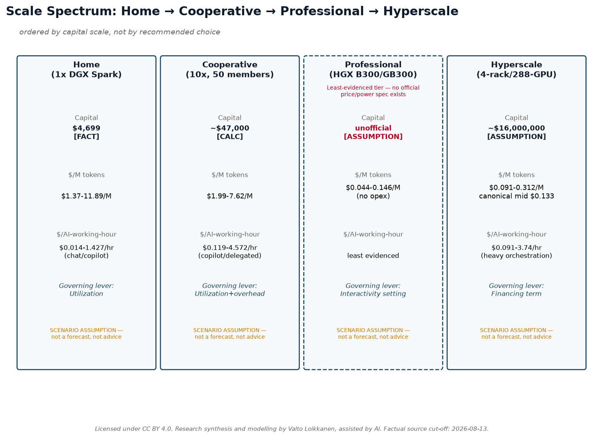

# Why Are They Spending Trillions on AI?

### The numbers and economics behind the AI working-capacity revolution—from electricity and infrastructure to tokens, robots, value, ownership, and agency.

**Author:** Valto Loikkanen
**Status:** v1.0 research package
**Research initiated:** August 12, 2026
**Factual source cut-off:** 2026-08-13
**Licence:** CC BY 4.0 — Attribution 4.0 International, covering this paper's original prose, diagrams, and model structure. Readers may copy, redistribute, remix, adapt, and build upon this material for any purpose, including commercially, with attribution. **This licence does not extend to** quoted third-party statements, third-party company/product names and logos, or third-party data cited from external sources — see `LICENSE` at the repository root for the full scope note.
**Suggested attribution:** "Research synthesis and modelling by Valto Loikkanen, assisted by AI."
**Preferred citation:** see `CITATION.cff` at the repository root.

---

## Table of Contents

- Front Matter (sections 1-5)
- Part I — The question behind the AI boom (sections 6-9)
- Part II — First principles: from energy to tokens (sections 10-15)
- Part III — From tokens to working capacity (sections 16-20)
- Part IV — Value, information, and leadership (sections 21-25)
- Conceptual bridge — From AI working capacity to new value (unnumbered, between Parts IV and V)
- Part V — Ownership, access, and possible market architectures (sections 26-30)
- Part VI — Scale scenarios and tangible examples (sections 31-36)
- Part VII — What this can mean for different readers (sections 37-42)
- Closing (sections 43-45)

---

## 1. Executive Summary

Since roughly 2023, and sharply since 2025–2026, a small group of companies, executives, and financial institutions have committed hundreds of billions — and now, on their own stated ambitions, potentially trillions — of dollars to AI infrastructure: chips, data centers, electricity contracts, and financing structures built to support them. The question this paper actually asks is not "is this a bubble" — it is **what would need to be true for this spending to make economic sense, and how much of that is independently checkable today versus merely asserted by people who benefit from it being believed.** This paper traces the money and the logic behind it, one verifiable layer at a time, without assuming any of it is either obviously justified or obviously a bubble.

The chain runs: **energy → hardware → compute → models → tokens → AI working capacity → digital work → outcomes → value → agency.** Each arrow is a real conversion with its own cost and its own uncertainty. Electricity becomes usable only once it powers chips; chips only matter once they run models; models only matter once they produce tokens; tokens only matter once they're organized into working capacity — the ability to actually get something done, shaped by model capability, infrastructure, information/context, tools, orchestration, reliability, and human direction. Working capacity only matters once it's pointed at real work; and — this is the step most forecasts skip — work only matters once it produces an *outcome* worth something to somebody. Value is not a mechanical output of the earlier steps. It can be positive, zero, or negative, and no amount of cheap compute changes that.

A parallel chain is emerging for physical work: **capital + energy + maintenance + utilisation + orchestration → humanoid physical working capacity** — the same logic applied to robots instead of tokens, at a much earlier and less certain stage of commercial maturity, as explored in Part V.


On the numbers assembled here (Part I onward), the headline financing commitments are real and independently corroborated: on August 10, 2026, Nvidia and six financial institutions — Apollo, Blackstone, BlackRock, Brookfield, Goldman Sachs, and KKR — announced financing platforms intended to mobilize more than $500 billion [OBSERVED FACT] in third-party capital for AI infrastructure, with BlackRock's Larry Fink stating on the record that the eventual figure could reach "trillions of dollars over the coming years" [ATTRIBUTED STATEMENT, Fink]. Jensen Huang's own stated per-gigawatt build cost — "something like $50, $60 billion" [ATTRIBUTED STATEMENT, Huang] — sits at the high end of, but broadly consistent with, independent analyst estimates found for this paper. What is *not* independently provable at this stage is whether the demand these executives describe — a historical usage ratio showing per-user token consumption rising roughly a millionfold over six and a half years, derived by comparing OpenAI's own reported 2019 and 2026 usage figures [DERIVED CALCULATION], alongside Sam Altman's own attributed claim of a further million-fold expansion still to come [ATTRIBUTED STATEMENT, Altman], and OpenAI's own unaudited internal telemetry showing its coding agent Codex now accounts for 99.8% of its weekly internal output tokens [ATTRIBUTED STATEMENT, OpenAI] — will continue at anything like the pace its proponents describe, or whether it will produce value commensurate with the capital being committed.

This paper does not resolve that question, and does not try to. Instead it separates the layers that are usually collapsed into one misleading number — raw energy cost, hardware-amortized cost, financed-asset cost, full infrastructure cost, utilization-adjusted cost, token production cost, and workload cost — and keeps the final, most important step, *outcome and value*, visibly and permanently separate from all of them (Parts II–IV). It also examines, on its own numbers and without asserting it is the answer, one candidate architecture for who ends up *owning* the infrastructure, information, and agents this buildout creates (Part V) — because the trillions being spent are not just a bet on capability; they are a bet on a particular allocation of control.

**Ten-second takeaway:** Trillions are being committed because a small number of well-positioned people believe cheap, abundant AI working capacity is coming and will be worth more than it costs to build — but working capacity is not the same as value, and nothing in the numbers proves that belief right.

---

## About the author, perspective and method

Valto Loikkanen is an international entrepreneur, systems architect, and AI-native product builder who creates concrete products, ventures, and open reference frameworks for real markets.

For more than a decade, his work has sat at the intersection of entrepreneurship, innovation, and digital platforms and ecosystems: how new technologies become useful products, new ventures, scalable markets, and verified new value. He has contributed to startup- and innovation-ecosystem work across more than 30 ecosystems internationally, alongside work in digital finance, platform economy, personal data, customer experience, and AI.

Alongside building ventures and products, he has been invited as an international expert to advise governments, ministries, cities, universities, European Commission initiatives, and international innovation consortia. This work has covered entrepreneurship and innovation ecosystems, digital transformation, international cooperation, access to risk finance, platform economy, and research and innovation programmes, including evaluation of consortium and innovation projects.

His current work includes personal AI and personal-data architecture through Prifina; AI-native product, customer-experience, and advisory work through ValtoAI; and the open PIOS and EIOS reference frameworks. PIOS explores owner-controlled personal information and AI infrastructure; EIOS applies related principles to organizations, governed information, and agent-ready operating context.

This background provides the perspective behind this paper: not only how AI infrastructure and working capacity can be financed, built, and operated, but how they may become useful work, verified new value, viable market activity, and different forms of ownership and sovereignty.

This paper is independent open research, not investment, procurement, legal, policy, or technology advice. It combines publicly available evidence, attributed industry statements, transparent calculations, scenario assumptions, and interpretation. AI tools were used under the author's direction to accelerate research, modelling, drafting, and consistency checking; they are not treated as source authority.

The purpose is to provide a model that readers can inspect, challenge, reproduce, improve, and adapt to their own context — not to present a settled forecast or a single prescribed outcome.

**Disclosure:** the author's current work includes personal-data ownership, personal AI, open infrastructure, and cooperative or distributed ownership models. These perspectives inform the questions explored in this research. The paper therefore aims to make assumptions, alternatives, benefits, constraints, and trade-offs explicit rather than presenting any one model as universally superior. (This disclosure is restated, with additional specificity about named ventures and frameworks, at Method §3.4.)

---

## 2. How to Use This Research

*A shorter, one-page version of this guidance — plus what this research can and cannot establish, and how to challenge or extend it — is available standalone as `00-how-to-use-this-research.md`. See also `20-appendix-known-limitations.md` for a consolidated list of live uncertainties this section's evidence-class discipline surfaces throughout the paper.*

*A note on this document's visuals, for readers with only the PDF: this paper embeds its four most load-bearing diagrams (the end-to-end working-capacity chain, the ownership stack, the scale spectrum, and the new-value bridge) directly at their point of use. The remaining diagrams in the full 11-diagram set, the presentation deck, and the Excel workbook are repository-only assets — see `README.md`'s reading-path guidance if you are reading this from the repository rather than a standalone PDF.*

This paper is written for six reader lenses. **No lens is prioritized over any other** — this is a deliberate editorial choice, not an oversight, and it holds throughout every part of the paper, not just here. Each lens will find different sections most load-bearing; all are welcome to read the whole thing, skip to their own section, or use the workbooks as standalone tools.

- **Individual.** Interested in what a personal AI working-capacity setup costs to own versus rent, and what "owning your AI" (Part V) would actually mean for you. Start with Part III (the cost-tier tables, Home tier) and Part V (ownership architecture).
- **SME / owner-manager.** Interested in whether dedicated or cooperative AI compute makes sense for a business, and where AI changes competitive dynamics in service delivery. Start with Part III (Cooperative and Professional tiers) and the SME/scale-up argument referenced in Part V.
- **Finance / infrastructure investor.** Interested in the hyperscale financing numbers, per-gigawatt costs, and the gap between executive statements and independently audited figures. Start with Part I (the financing announcement) and Part IV (investment-thesis tiers) — and note the non-advice boundary restated in every scenario section.
- **Government / region / community.** Interested in power-grid demand implications, financing concentration, and policy-relevant ownership-architecture questions (e.g., regional cooperative infrastructure vs. centralized mega-platforms). Start with Part I (power-demand figures) and Part V.
- **AI builder / operator.** Interested in the hardware benchmarks, $/token production costs, and usage-intensity-to-working-capacity conversion. Start with Part III (workbook tables) and Part II (the token/working-capacity chain).
- **Educator / researcher / journalist.** Interested in the evidence-classification method itself, the source register, and the worked corrections (e.g., the retail-vs-owned-production mix-up in Section 4 below). Start with this Method section, then the full source register.

Every numeric table in this paper carries its own evidence-class tags inline; readers who want to build their own version of any model can go directly to the companion workbooks (Global Baseline, AI Working-Capacity Conversion, Token-Factory Scenarios, Investment-Thesis Notes, Humanoid Working-Capacity, and the Localized/EUR-Finland template), each of which documents its formulas explicitly so every input can be swapped for the reader's own verified numbers.

---

## 3. Method, Evidence Classes, and Caveats

This paper synthesizes public statements, official documentation, and independently verifiable figures into a single connected economic model. It was researched and drafted with a source cut-off of 2026-08-13; every factual claim was checked against a live or primary source on or immediately before that date wherever possible, and every gap in that checking is stated plainly rather than papered over. Most claims were originally checked on or before 2026-08-12, with a small number of specific corrections (the DGX Station cooperative-cost clarification and the confirmed $0.123/M-tokens GB300 figure) independently verified on 2026-08-13 and folded into this same source register rather than treated as a separate addendum — individual citation dates throughout this paper reflect the actual date each source was checked.

### 3.1 The five evidence classes

Every substantive statement in this paper is classifiable into exactly one of five classes, tagged inline or in table legends:

1. **OBSERVED FACT** — primary documentation, official specs/pricing, filings, regulation, or a direct recording/transcript, independently checked against a live/primary source on or immediately before 2026-08-12, with an exact citation.
2. **ATTRIBUTED STATEMENT** — what a named executive, organization, or source says publicly and on the record. This is *not* automatically treated as independently proven fact — even confirming that someone said exactly those words is a separate, narrower claim (itself an OBSERVED FACT about the statement's existence) from whether the underlying claim is true.
3. **DERIVED CALCULATION** — transparent arithmetic from cited OBSERVED FACT or ATTRIBUTED STATEMENT inputs, with the formula always shown, never just the result.
4. **SCENARIO ASSUMPTION** — a visible, editable parameter used to explore a possible case (an illustrative electricity price, financing rate, or utilization level). Stated plainly as an assumption, not a market figure, with a note on what it controls.
5. **INTERPRETATION** — a clearly labelled explanation of how facts, statements, and scenarios may connect. Never presented as if it were a fact.

Nothing in this paper reproduces long verbatim passages from any transcript or article; quotations are short (one sentence, rarely two) and always cited. No figure, quote, or URL has been fabricated — where something could not be verified, it is labelled UNVERIFIABLE or classified as an ATTRIBUTED STATEMENT rather than given invented corroboration. The full source register — a claim-by-claim ledger covering 67 individual checks across ten research clusters (A–J) — is published alongside this paper so every number can be traced to its source and its confidence level.

### 3.2 A worked methodology correction: retail price is not production cost

One specific correction made mid-project is preserved here deliberately, as a teaching example rather than smoothed over. An earlier pass in this research mistakenly priced a hypothetical self-owned compute facility using retail frontier-lab API prices (OpenAI, Anthropic, Google's published $-per-million-token rates) as if those were a cost basis. They are not. Retail API prices are a finished, marked-up, proprietary-model *product* price — they bundle a lab's R&D amortization, safety work, margin, and reliability guarantees. They say nothing about what it actually costs to run open-weight inference (e.g., DeepSeek, Qwen, Kimi) on owned or rented hardware.

The corrected framing, used consistently across Parts III and IV: **owned-production cost** (electricity + amortized/financed hardware + facility/operations, running open-weight models) is kept structurally separate from **retail benchmark pricing** (what the frontier labs charge for access to their own proprietary models) in every table. The two can legitimately differ by one to two orders of magnitude in either direction depending on utilization, model choice, and what is counted as "cost" — that gap is the point of keeping them separate, not an error to reconcile away. This same discipline extends to the required economic-layer separation used throughout the paper: raw energy cost → hardware-amortized production cost → financed asset cost → full operating infrastructure cost → capacity/utilisation cost → token production cost → workload/AI-working-capacity cost → outcome and value. These layers are never collapsed into a single number, and the last step — outcome and value — is never treated as mechanically determined by the ones before it.

### 3.3 Caveats

This paper treats Jensen Huang, Sam Altman, and Mark Zuckerberg as three independent, differently-incentivized sources to be synthesized and shown side by side — never endorsed, never debunked. It does not declare centralization, decentralization, open source, or any ownership model universally better. A "$0.123 per million tokens" GB300 inference-cost figure, initially flagged UNVERIFIABLE during this research, was independently confirmed directly on NVIDIA's own site on 2026-08-13 — it describes a 72-GPU GB300 NVL72 rack at 116 tokens/sec/user using NVIDIA Dynamo and TensorRT-LLM, and is used in this paper only at that scope, never applied to a workstation or desktop-class device. Two other widely repeated figures — a "2.8 million tokens/sec per megawatt" throughput figure and an "NVIDIA reference agentic workload of 32K input + 8K output tokens per turn" — remain UNVERIFIABLE against any primary source found during this research and are used nowhere as if confirmed. Where a figure comes from a named executive with a direct financial interest in the claim being believed (for instance, Huang's per-gigawatt cost estimate, or Fink's forward-looking capital-raising figure), this is noted at the point of use, not just here.

### 3.4 Disclosure

The author has commercial and advocacy interests in personal AI infrastructure and cooperative/ownership-based AI models through Prifina (personal AI and personal-data architecture), Digiole (Talking Product AI), ValtoAI (AI-native product, customer-experience, and advisory work), and the open PIOS and EIOS reference frameworks (PIOS: owner-controlled personal information and AI infrastructure; EIOS: related principles applied to organizations, governed information, and agent-ready operating context). This paper synthesizes third-party public statements and independently verifiable figures; it was not commissioned by and should not be read as endorsed by Nvidia, OpenAI, Anthropic, Google, Meta, Y Combinator, CNBC, or any named individual. The cooperative/ownership architecture discussed in Part V is one candidate model evaluated on its own numbers; readers should weigh the author's stated interest in that outcome accordingly.

### 3.5 Non-advice statement

This material is educational research and scenario analysis. It is not investment, legal, tax, procurement, or policy advice. All scenario models in this paper and its companion workbooks are editable illustrations built on stated, visible assumptions, not forecasts or recommendations — a boundary restated explicitly in every investment-thesis or scale-scenario section throughout the paper, not only here.

---

# Part I — The Question Behind the AI Boom

*Evidence-class shorthand used throughout this section, consistent with the rest of this paper: **[FACT]** = Observed Fact · **[ATTR]** = Attributed Statement · **[CALC]** = Derived Calculation · **[ASSUMPTION]** = Scenario Assumption · **[INTERP]** = Interpretation. Full definitions appear in the Method section.*

## 6. Why are they spending trillions on AI?

On August 10, 2026, Nvidia signed memorandums of understanding with six of the world's largest asset managers and investment banks — Apollo Global Management, Blackstone, BlackRock, Brookfield Asset Management, Goldman Sachs, and KKR — to "mobilize more than $500 billion in third-party capital" for AI infrastructure on behalf of hyperscalers, frontier AI labs, and enterprises **[FACT — CNBC, Hugh Son, Aug 10 2026, corroborated by Fortune the following day]**. On the same live broadcast, BlackRock CEO Larry Fink told CNBC's Becky Quick: "we need to raise $500 billion... but we're going to have to raise trillions of dollars over the coming years" **[ATTR — Fink, CNBC Closing Bell Overtime transcript, Aug 10 2026]**. Nvidia CEO Jensen Huang, on the same panel, put a per-unit price on that buildout: "each gigawatt is something like $50, $60 billion," covering energy, land, shell, and compute **[ATTR — Huang, same transcript]**.

This is the reader's actual question, stated plainly rather than assumed away — and it is not "is this a bubble." It is: **what would need to be true for six of the most risk-disciplined capital allocators on earth to rationally commit sums of this size, on the record, in public, to a technology whose retail products (see Section 8, and the pricing detail in Part II) still cost from a few dollars to several dozen dollars per million tokens** **[FACT/ATTR — see Section 8 pricing table, Part II]**, and how much of that "what would need to be true" is independently checkable today versus asserted by parties with a direct stake in the answer. Three structurally different answers are on offer from three structurally different sources, and this paper's job is to lay them side by side, test what can be tested, and let the reader see what remains open — not to pick a winner or declare the bet already won or lost. Huang and the financiers around him describe compute as a new asset class, comparable to electricity grids or telecom towers. Sam Altman describes intelligence itself becoming a utility-like commodity whose falling cost drives its own demand. Mark Zuckerberg describes superintelligence as something that should end up personal — owned and controlled by the individual, not concentrated in any one company. None of these is self-evidently true, none is self-evidently false, and none is neutral: each is offered by a party with a direct financial or strategic stake in it being believed. Section 8 sets these three out formally, tagged by evidence class; the rest of this paper (Parts II–V) tests each claim's numbers against what can actually be verified — the electricity, hardware, token-cost, and ownership arithmetic that either supports or strains the story being told about it.

## 7. What would need to be true — bubble, infrastructure transition, or both

**[INTERP]** Rather than force a choice between "this is a speculative bubble" and "this is a genuine infrastructure transition," this section asks what each framing would require to be true, and checks each requirement against what this research could actually verify. Both framings have real, citable support, and — importantly — they are not mutually exclusive: infrastructure transitions have historically included overbuilding, mispriced risk, and capital that does not survive the transition even when the underlying technology does (the 1990s fiber-optic buildout is the standard analogy, though this paper does not independently verify that comparison's numbers and treats it as a commonly-invoked interpretive frame, not a proven precedent).

**Evidence that supports an "infrastructure transition" reading:**
- Huang explicitly frames the shift in infrastructure/investment terms: Nvidia's chips are, in his own words, an "investable asset" **[ATTR — CNBC, Hugh Son, "Nvidia lines up $500 billion in financing as CEO Jensen Huang tells CNBC his chips are 'investable asset'," Aug 10 2026]**.
- The $500B financing structure itself is a real, signed set of MOUs with six named institutions, not a rumor or a projection **[FACT]**.
- Independent, non-Nvidia-affiliated forecasts of US data-center power demand offer supportive context: Boston Consulting Group has reportedly projected a 50–80 GW AI-driven power shortfall by 2030, and S&P Global reported hyperscale data centers already drawing 64.4 GW from the US grid in 2025 **[ATTR — both found via aggregated search summary, not independently re-fetched from the primary reports in this research pass]**. That these independent figures are directionally consistent with the scale of Fink's ">70 GW" claim is this paper's own reading of how the two data points relate to one another, not an independently proven equivalence between them **[INTERP]**.
- A second, separate infrastructure deal announced the following day — IBM and Together AI's $240 million multi-year agreement for a dedicated Nvidia HGX B300 inference cluster on IBM Cloud — shows capital committing to inference capacity outside the six-firm financing story entirely, which is evidence of breadth rather than a single orchestrated narrative **[FACT — IBM Newsroom press release, Aug 11 2026]**.

**Evidence that supports treating some claims with bubble-appropriate skepticism:**
- The $50–60B-per-gigawatt figure and the ">70GW" and "trillions of dollars" figures were stated by Huang and Fink themselves, live, on the record — Huang sells the chips being priced, and Fink's firm stands to help place and manage the capital being raised. These are ATTRIBUTED STATEMENTS from interested parties, not audited third-party cost studies **[ATTR]**.
- Independent 2025–2026 analyst estimates for per-gigawatt AI buildout cost cluster somewhat lower than Huang's figure — approximately $49B/GW (Morgan Stanley), $47B/GW (Foxconn), $38B/GW (Epoch.ai), and $35B/GW (Bernstein), per aggregated search results not individually re-verified against primary analyst notes in this research pass **[ATTR, low-confidence sourcing]** — which places Huang's $50–60B figure at the higher end of, though not wildly outside, the contemporaneous range.
- Sam Altman's own framing of "demand grows 10x a year" (see Section 9 for the exact sourcing problem with this specific figure) is a forward-looking, self-interested claim rather than a settled fact about future demand **[ATTR]**. A related claim sometimes paraphrased as Huang saying AI tokens are "incredibly profitable" for frontier labs could not be traced to a specific, dated primary transcript passage in this paper's research pass — the underlying sentiment (that frontier-lab token economics are favorable to the labs) should be read as an unverified, secondhand characterization rather than a confirmed direct quotation **[ATTR, unverified exact wording/provenance]**.
- This paper's own cost-tier modelling (Part II) shows that owned-production cost for open-weight inference can fall 1–2 orders of magnitude below retail frontier-lab API prices depending on utilization and hardware generation **[CALC/INTERP — Token-Factory Scenario Workbook, Release Asset #10, Section 2]** — a gap wide enough that "how profitable is a token, really" depends entirely on which side of that gap, and which utilization assumption, is being discussed. Fast hardware depreciation (Nvidia's own marketing claims Vera Rubin delivers "up to 10x more tokens per megawatt" than GB200 **[ATTR — Nvidia product page]**) means capital committed today at today's hardware economics is itself a bet that this year's numbers hold up against next year's chips.

**The disciplined position this paper takes:** the infrastructure-transition case and the bubble-risk case are drawing on overlapping facts, not competing ones. The same $500B financing commitment can simultaneously be real infrastructure buildout *and* include capital that is mispriced relative to the risk, because those are different claims answered by different evidence — one by the existence of the signed MOUs, the other by whether the underlying demand and margin assumptions embedded in them hold. Part II's cost-layer modelling and Part V's ownership-architecture discussion return to this tension with numbers rather than narrative.

## 8. What leading labs, Nvidia, infrastructure financiers, and platform companies have publicly said

The three sources synthesized below are treated as independent, differently-incentivized voices — not weighed against each other for correctness. Each is shown with its own structural framing, its strongest verifiable quotes, and the evidence class attached to each claim.

| Source | Structural framing | Representative on-record statement | Evidence class | Primary source |
|---|---|---|---|---|
| Jensen Huang (Nvidia) + six-firm financing panel (Solomon/Goldman Sachs, Fink/BlackRock, Gray/Blackstone, Zelter/Apollo, Flatt/Brookfield, Szlezak/KKR) | **Compute as infrastructure** — AI compute as a financeable, revenue-generating asset class, analogous to electricity or telecom | Nvidia's chips are an "investable asset" | ATTR | CNBC, Hugh Son, "Nvidia lines up $500 billion in financing as CEO Jensen Huang tells CNBC his chips are 'investable asset'," Aug 10 2026 |
| Sam Altman (OpenAI) | **Intelligence as utility** — capability becoming cheap and abundant, with usage rising as price falls, echoing utility/commodity demand curves | "The cost to use a given level of AI falls about 10x every 12 months, and lower prices lead to much more use" | ATTR | blog.samaltman.com, "Three Observations" (this specific claim is about *cost decline*, not a direct demand-growth-rate figure — see Section 9) |
| Mark Zuckerberg (Meta) | **Superintelligence as personal** — capability distributed to and controlled by individuals rather than concentrated in one company | "We propose a philosophy based on individual empowerment as the source of prosperity, invention as the primary purpose of superintelligence, and balance of power as the foundation of safety" | FACT (that Zuckerberg's essay states this verbatim) / ATTR (as a claim about how AI *should* or *will* develop) | about.fb.com, "The Future is for Everyone," published Aug 10 2026 |

Several structural overlaps are worth naming without editorializing about which framing is "right":

- **All three use an infrastructure/utility analogy**, but apply it to a different layer of the stack: Huang to the physical compute buildout, Altman to the intelligence/cost curve running on top of it, Zuckerberg to the personal-agent layer sitting on top of both. This is consistent with — not proof of — this paper's core analytical chain (energy → hardware → compute → models → tokens → AI working capacity → digital work → outcomes → value → agency): each executive is speaking from the layer their business occupies.
- **All three frame distribution/concentration as the central risk, but locate the risk differently.** Altman: describing a future he says should be prevented — "you're going to get a cure for cancer, you're going to have material abundance, but you will have no freedom, you will have no agency, it will be a perfect surveillance state" — framed as the result of overreacting to AI safety, i.e., a concentration of control that comes at the expense of individual freedom and agency **[ATTR — Altman, YC Startup School closing session, Chase Center, San Francisco, July 26 2026, quoted via news.com.au/europesays.com coverage; corroborated in substance, without the word "surveillance," by CC BY 4.0 attendee notes, github.com/Princeu3/yc-startup-school-2026-notes]**. Zuckerberg: open source framed explicitly as "a positive and important force for empowering people and preventing centralization" **[FACT — verbatim, about.fb.com essay]**. Huang and the financing panel do not make an explicit concentration argument in the transcript reviewed for this paper; their framing is about mobilizing capital at scale, which is itself a different kind of concentration (of financing control among a small number of asset managers) — a point this paper's Part V returns to, without asserting that Huang's silence on the point constitutes a position.
- **None of the three claims is independently audited.** Huang's per-gigawatt cost, Fink's demand forecast, Altman's cost-decline curve and demand narrative, and Zuckerberg's "fully private mode... even Meta cannot see" commitment are all on-the-record statements by named parties about their own plans, products, or beliefs — not third-party-verified facts. That they were said, on the record, is independently confirmed for all three (an OBSERVED FACT about each statement's existence); whether the underlying claims turn out to be true is a separate question this paper does not resolve on their behalf.

## 9. The difference between public statements, demand signals, financial claims, and forecasts

A recurring failure mode in AI commentary is treating these four categories as interchangeable. They are not, and keeping them separate changes what each piece of evidence in this paper is allowed to prove.

**Public statements** are simply what a named person or organization said, on the record. That a statement was made is frequently an OBSERVED FACT (checkable against a transcript or primary text); what the statement *claims* is an ATTRIBUTED STATEMENT until independently corroborated. Example: Zuckerberg's essay states verbatim that Meta will build "a fully private mode where even Meta cannot see or grant access to your information" **[FACT that this sentence appears in the primary source; ATTR as a claim about what Meta will actually deliver]**.

**Demand signals** are usage data — ideally third-party-measured, but in practice, in this research corpus, almost always self-reported by the company whose business benefits from the signal looking strong. OpenAI's own blog post states Codex reached "99.8% of weekly output tokens generated within OpenAI," that by May 2026 "70.2%... made [a request] estimated to exceed one hour [of human work]" and "25.6%... exceed eight hours," and that by June 2026 its heaviest users "regularly generated more than 60 hours of Codex agent turns per day" **[ATTR — OpenAI, "How agents are transforming work," June 25 2026; independent press coverage explicitly notes "every number comes from OpenAI itself" with no third-party audit]**. This is real, citable evidence that internal usage grew — but it describes OpenAI's own employees using OpenAI's own product, not an independently measured market-wide demand curve, and Part II and Part III of this paper use it only as a directional input to usage-intensity bands, not as a validated growth rate.

**Financial claims** are the most independently checkable of the four when they involve signed instruments: the $500B six-firm financing MOU and the $240M IBM/Together AI cluster agreement are both confirmed, real, dated commitments **[FACT]**. But a signed financing structure existing is a different claim from that structure being adequately priced, fully drawn, or ultimately profitable — none of which this paper's source material allows it to verify.

**Forecasts** are explicitly forward-looking and carry the least evidentiary weight of the four, even when stated confidently by well-informed people. Fink's ">70 gigawatts" and "trillions of dollars over the coming years" are forecasts, not measurements **[ATTR]**. Altman's YC Startup School remarks about worldwide inference demand are a useful case study in why sourcing precision matters here: independently corroborated attendee notes of that specific talk describe only a hedged, unquantified claim — "he expects worldwide demand to keep growing for many years," using an electricity-price analogy, with no percentage stated **[ATTR — corroborated via CC BY 4.0 attendee notes, github.com/Princeu3/yc-startup-school-2026-notes]**. The frequently-repeated "10x a year" demand-growth figure traces most reliably not to that talk but to a *different* Altman claim in a separate blog post about the *cost* of a given level of intelligence falling roughly 10x every 12 months, which he links — via a Jevons-paradox-style argument — to higher usage, without stating usage itself grows at any specific rate **[ATTR — blog.samaltman.com, "Three Observations," covered by Forbes]**. This paper treats the cost-decline figure and the demand-growth figure as two distinct, separately-sourced claims, and does not present the "10x/year demand" framing as something confirmed to have been said at the Startup School talk specifically.

The practical rule this paper follows, restated here and applied consistently in Parts II–V: a statement being real (someone said it) never upgrades the underlying claim to fact; a self-reported demand signal is evidence of that company's internal usage, not of market-wide demand; a signed financing instrument is evidence of committed capital, not of its eventual return; and a forecast — however credentialed the forecaster — remains a forecast, tagged and treated as such throughout this paper's cost and scenario modelling in Part II, Part III, and Part IV.

---

This section draws on the shared Source Register (clusters C, D, E) and the companion workbooks included in this release package (Global Baseline Workbook, Release Asset #7; AI Working-Capacity Conversion Workbook, Release Asset #9; Token-Factory Scenario Workbook, Release Asset #10; Investment-Thesis Notes, Release Asset #12) for forward references to Parts II–V. No new figures were introduced beyond what appears in the verified source register.

---

# Part II — First Principles: From Energy to Tokens

*This Part is the evidentiary spine of the paper: it walks the opening links of the core analytical chain introduced in Part I — energy → hardware → compute → models → tokens → AI working capacity — and shows the arithmetic behind each link using only the cited source register and the companion workbooks (the **Global Baseline Workbook**, release asset #7, and the **Token-Factory / AI-Factory Scenario Workbook**, release asset #10). Sections 10–15 do not yet address outcome, value, or ownership — those are picked up later in the paper (value in the sections following Part II; ownership architecture in Part V) — because, as stated throughout this paper, working capacity is not value, and nothing in this Part should be read as implying otherwise.*

**Evidence-class legend used throughout:** **[FACT]** = Observed Fact · **[ATTR]** = Attributed Statement · **[CALC]** = Derived Calculation (formula always shown) · **[ASSUMPTION]** = Scenario Assumption (editable, not a market figure) · **[INTERP]** = Interpretation.

---

## 10. Electricity, power, energy, PUE, and "tokens per watt"

The chain starts with a unit distinction that gets blurred constantly in public discussion: **power** (kW or MW — capacity to do work at an instant) versus **energy** (kWh or MWh — power sustained over time). A gigawatt of AI infrastructure is a power figure; what it actually produces in a year depends on how many of those kilowatt-hours are bought, at what price, and for how much of the year the hardware is actually working — the utilisation question taken up in Section 12.

**Rack-level power, as an observed reference point.** NVIDIA's own GB300 NVL72 product page does not publish a power-draw figure at all **[FACT]** (nvidia.com/en-us/data-center/gb300-nvl72/, checked 2026-08-12). The most authoritative power number found in this project's source register comes from an OEM partner spec sheet: Lenovo's GB300 NVL72 reference document states each rack "consumes 135 kW TDP; up to 155 kW peak depending on workload" **[FACT]** (Lenovo Press LP2357, checked 2026-08-12). That rack contains 72 Blackwell Ultra GPUs and 36 Grace CPUs, with 1,440 PFLOPS of dense FP4 compute (NVIDIA states this rises to roughly 10,800 PFLOPS "with sparsity," a distinct, higher-multiplier figure that should not be quoted interchangeably with the dense number) **[FACT]**.

**What PUE would add — and why this paper does not quote a specific figure for it.** Power Usage Effectiveness (PUE) measures total facility energy draw (IT load *plus* cooling, power conversion losses, and other overhead) divided by IT load alone — a PUE of 1.3, for example, means 30% more energy is consumed by the building than by the compute itself. No GB300-class facility PUE figure was found or independently verified anywhere in this project's source register. Readers should treat the rack-level TDP figures above as **IT-load power only**; any real facility's total energy draw will be higher by a factor this paper cannot specify without a verified source. Where the workbooks below model "electricity cost," they are modeling IT-load power at an assumed retail/industrial price, not a PUE-adjusted total facility cost — this is stated as a limitation, not resolved.

**Throughput: the "2.5M tokens/second" figure, corrected.** NVIDIA's own developer blog reports an MLPerf Inference v6.0 Offline-scenario result of 2,494,310 tokens/sec on DeepSeek-R1, which NVIDIA itself captions as "2.5M token/s" **[FACT]** (developer.nvidia.com, checked 2026-08-12). The critical nuance, confirmed directly from NVIDIA's own text: this is an **aggregate across four interconnected GB300 NVL72 systems (288 GPUs total)**, not a single 72-GPU rack. NVIDIA's own per-GPU figure for the same Offline scenario is 9,821 tokens/sec/GPU (v6.0), up from 5,842 tokens/sec/GPU in v5.1 — a 1.68x generational gain **[FACT]**. The Server (interactive) scenario shows 8,064 tokens/sec/GPU (v6.0) versus 2,907 (v5.1), a 2.77x gain **[FACT]**. Any use of "2.5M tokens/second" as a *single-rack* figure would misstate NVIDIA's own benchmark by roughly 3.5x; this paper and its companion workbooks scale it correctly.

**Tokens per watt.** Multiplying the observed per-GPU Offline throughput by a rack's 72 GPUs gives an implied single-rack throughput of 9,821 × 72 ≈ **707,112 tokens/sec [CALC]**. Dividing by the OEM-observed rack power (135 kW TDP / 155 kW peak) gives:

- At 135 kW: 707,112 ÷ 135 ≈ **5,238 tokens/sec per kW ≈ 5.2M tokens/sec per MW [CALC]**
- At 155 kW (peak): 707,112 ÷ 155 ≈ **4,562 tokens/sec per kW ≈ 4.6M tokens/sec per MW [CALC]**

This is a *theoretical extrapolation from an offline maximum-throughput benchmark*, not a figure NVIDIA or SemiAnalysis published directly for this exact configuration — it should not be confused with SemiAnalysis's own live InferenceX "compare-per-dollar" dashboard, which reports tokens-per-MW at *specific interactivity (latency) targets* rather than at unconstrained maximum throughput. At the interactivity points independently checked in this paper's source register, InferenceX shows roughly 1.67M–3.89M tokens/sec/MW for GB300 running DeepSeek-R1, depending on how much per-user latency is tolerated **[FACT-adjacent, interpolated from a live dashboard]**. The oft-repeated "2.8M tokens/sec/MW" figure sits inside that observed range but could not be found verbatim on SemiAnalysis's site as of this check and should be treated as **unverifiable as an exact published figure** rather than confirmed. **[INTERP]** The gap between the ~5.2M/MW theoretical-maximum calculation above and the ~1.7–3.9M/MW interactivity-constrained dashboard figures illustrates a general rule: "tokens per watt" is not one number for a given chip — it depends on how much latency per user you are willing to trade for throughput, exactly as a factory's units-per-hour depends on line speed versus defect tolerance.

The **Global Baseline Workbook** (release asset #7) carries these same OBSERVED inputs into its Hyperscale tier build, dividing the benchmark correctly across the real 4-rack/288-GPU aggregate rather than mis-attributing "2.5M tok/s" to a single rack, as flagged there explicitly.

---

## 11. Hardware as productive capital equipment

The next link in the chain — hardware — is best understood not as consumer electronics but as **productive capital equipment**, the same category as a power plant, a fleet of trucks, or a factory production line. Jensen Huang framed Nvidia's chips this way on CNBC's Closing Bell Overtime on August 10, 2026, describing the company's AI factory platform as an "investable asset" — the phrase CNBC's own headline attributes to him ("Nvidia lines up $500 billion in financing as CEO Jensen Huang tells CNBC his chips are 'investable asset'") — on the grounds that the platform is productive and revenue-generating **[ATTR]** (CNBC article, checked 2026-08-12). Beyond this specific phrase, this paper does not reproduce a longer verbatim passage from the broadcast here, since no entry in this project's source register independently confirms a longer multi-clause quotation from the transcript itself. This is Huang's own characterization of his company's product — an on-the-record claim from the party that sells the chips, not an independently audited economic classification, and it is presented here as one input to be weighed, not as settled fact.

**The capital stack, tier by tier — what is actually observed to exist and cost:**

| Tier | What it is | Capital cost | Evidence class |
|---|---|---|---|
| Prosumer / home | 1× NVIDIA DGX Spark: GB10 Grace Blackwell Superchip, 128GB unified memory, up to 1 PFLOP FP4, 240W power supply | $4,699 (Founders Edition MSRP, raised from $3,999 in Feb 2026) | **[FACT]** — nvidia.com and NVIDIA Developer Forums price-change notice, both checked 2026-08-12 |
| Professional / SME | 1× NVIDIA HGX B300: 8× Blackwell Ultra SXM GPUs, 2.1 TB memory, 144 PFLOPS sparse / 108 PFLOPS dense NVFP4 | **Not publicly priced by NVIDIA** | **[ASSUMPTION]** — no official price or power-draw spec exists; any figure used for this tier is an illustrative placeholder, flagged as such in both companion workbooks |
| Hyperscale | 1 rack of GB300 NVL72: 72 Blackwell Ultra GPUs, 36 Grace CPUs, 20 TB HBM3e, 130 TB/s NVLink, 135–155 kW | ~$4M/rack (illustrative — **not** an official NVIDIA price, an analyst-style estimate carried forward from background research) | **[ASSUMPTION]**, clearly distinct from the OBSERVED specs above it |

**Financing at industry scale.** On the same August 10, 2026 broadcast, Nvidia announced memoranda of understanding with six firms — Apollo Global Management, Blackstone, BlackRock, Brookfield Asset Management, Goldman Sachs, and KKR — aiming to mobilize more than $500 billion in third-party capital for hyperscalers, frontier labs, and enterprises **[FACT]** (confirmed directly against CNBC's own article text and corroborated same-day by Fortune, checked 2026-08-12). Huang stated on air that "each gigawatt is something like $50, $60 billion" to build, covering energy, land, power/shell, and compute **[ATTR]** — his own figure, not an audited cost. Larry Fink, joining remotely, repeated the same per-gigawatt figure and added that the U.S. alone will need "over 70 gigawatts" and that financing needs will grow from the initial $500 billion toward "trillions of dollars over the coming years" **[ATTR]**. Independent analyst estimates found via aggregated search (not individually re-verified against primary notes in this project) bracket Huang's figure as plausible-to-high rather than an outlier: Morgan Stanley ~$49B/GW, Foxconn ~$47B/GW, Bernstein ~$35B/GW, Epoch.ai ~$38B/GW upfront capex **[secondary, lower-confidence corroboration]**. This per-gigawatt figure and its financing structure are developed further as an investment-scenario tier in the companion **Investment-Thesis Scenario Notes** (release asset #12, Tier 4) — every use of it there, as here, carries the explicit non-advice boundary restated in Section 12 below.

**Depreciation risk is a hardware-tier property, not just a financing one.** NVIDIA's own marketing for its next-generation Vera Rubin NVL72 claims "up to 10x more tokens per megawatt" and "one-tenth the cost per million tokens" versus GB200 NVL72 **[ATTR — vendor claim]**. SemiAnalysis's independent benchmark-based analysis is considerably more conservative and workload-dependent: versus a current (July 2026) GB200 baseline, the advantage is roughly 1.5–3x cheaper per token; versus GB300, throughput-per-MW gaps range from about 2x at low interactivity to about 5.4x at high interactivity **[ATTR — independent but benchmark-derived, not identical to vendor claim]**. The point for this section: capital committed to today's hardware generation is committed against a curve that both the vendor and an independent analyst agree is moving quickly, which is precisely why Section 12 treats "replacement reserve" as a distinct cost layer rather than folding it into simple depreciation.

---

## 12. Financing, depreciation, interest, utilisation, operations, replacement reserve

This paper's methodology requires that these layers never be collapsed into one number:

| Layer | What it captures |
|---|---|
| Raw energy cost | $/kWh at the meter |
| Hardware-amortized production cost | capex ÷ expected life, no financing |
| Financed asset cost | capex + interest, per financing term |
| Full operating infrastructure cost | + facility power, cooling, networking |
| Capacity/utilisation cost | above cost ÷ *actual* (not maximum) utilisation |
| Token production cost | $/M tokens at the owned facility |
| Workload/AI-working-capacity cost | $/M tokens translated into $/agent-hour |
| Outcome and value | **not** mechanically determined by any of the above |

**Financing formula [CALC], used identically across every tier in both companion workbooks:**
`Monthly payment M = P × i / (1 − (1+i)^-n)`, where P = principal financed, i = monthly interest rate, n = number of monthly payments. An annual-payment variant, `Annual payment = P × r / (1 − (1+r)^-n)` with annual rate r and n in years, is used where an at-a-glance annual figure is more legible; the two conventions are not interchangeable and both workbooks flag which one is in use in each table.

**Term-length sensitivity, hyperscale tier, CAPITAL+FINANCING+ELECTRICITY ONLY — not the paper's canonical Hyperscale figure (from the Token-Factory Scenario Workbook, Section 4.1) [CALC]**, built on the OBSERVED rack specs and MLPerf benchmark from Section 10 above, an **[ASSUMPTION]** $16M capital figure for a 4-rack/288-GPU installation, and an **[ASSUMPTION]** $0.10/kWh electricity price at 90% utilisation. This table isolates the financing-term lever only and deliberately **excludes the opex/overhead layer** (facility, cooling, staffing, networking, replacement reserve) that this paper's canonical Hyperscale figure of $0.091–0.312/M tokens (mid $0.133/M, Section 34) includes — the lower numbers below are a partial-layer illustration, not a cheaper alternative measurement of the full Hyperscale cost:

| Financed term | Annuity factor AF(n,8%) | Annual financed capital | + facility power/yr | Total annual cost (capital+financing+electricity ONLY) | Cost per M tokens (partial layer) |
|---|---|---|---|---|---|
| 3 years | 2.577 | $6,206,900 | $447,800 | $6,654,700 | ~$0.094/M |
| 4 years | 3.312 | $4,832,600 | $447,800 | $5,280,400 | ~$0.074/M |
| 5 years | 3.993 | $4,007,300 | $447,800 | $4,455,100 | ~$0.063/M |
| 7 years | 5.206 | $3,073,000 | $447,800 | $3,520,800 | ~$0.050/M |

**[INTERP]** Longer financing terms mechanically lower the per-token financed-capital cost — but they also increase total interest paid and lock in today's hardware generation for longer against the fast-depreciating performance curve described in Section 11 (Vera Rubin's claimed multiple-x improvement over GB300). This table shows the arithmetic trade-off; it recommends no specific term. Adding the canonical mid-opex figure ($500,000/yr, Section 34) to any row above and recomputing brings the result back into the $0.091–0.312/M canonical range — this is the same model shown at a narrower layer of completeness, not a competing baseline.

**Utilisation is usually the single largest lever, at every scale.** The **Humanoid Working-Capacity Workbook** (release asset #11) demonstrates this cleanly outside the token-production context: holding financing and maintenance assumptions fixed, moving a piece of capital equipment from 2,000 to 8,000 productive hours per year cuts the cost-per-hour by roughly 3.5–4x at every price point in that workbook's model, because fixed capital and financing costs are constant while the denominator (hours) grows **[CALC/INTERP]**. The same mechanism governs a DGX Spark, an HGX B300 node, or a GB300 rack: idle capacity is pure sunk cost, since financing accrues whether or not the hardware is running.

**Replacement reserve.** Neither companion workbook treats hardware capital as a one-time, indefinitely-useful purchase. The Global Baseline Workbook's Hyperscale tier explicitly cross-checks straight-line depreciation ($16M ÷ 5 years = $3.2M/yr, implying ~$0.045/M tokens) against the financed figure above (~$0.063/M tokens at 5 years), isolating a financing premium of ~$0.011–0.0114/M tokens over pure depreciation **[CALC]** — a transparent, separable line item rather than a number baked silently into "cost."

*Boundary note, restated as required for every scale/investment-bearing section in this paper: none of the figures in this section are a recommendation to purchase, finance, or avoid any specific hardware tier, financing term, or utilisation strategy. They are editable scenario illustrations of cost structure, not a forecast of any real facility's economics, and not investment, legal, tax, or procurement advice.*

---

## 13. Compute, models, and inference — what is actually being produced

What the capital stack in Sections 11–12 actually *produces* is compute cycles converted, via a trained model, into inference output. Two distinct activities get conflated in casual usage and should not be here: **training** (the capital- and energy-intensive process of fitting a model's parameters to data, typically run once or periodically per model generation) and **inference** (running the already-trained model against new input to produce output — the ongoing, per-use activity this paper's cost tables model). Everything in Sections 10–12 and the companion workbooks concerns inference-side production cost, not training cost, which this paper does not attempt to model.

**The MLPerf benchmark context matters for what "output" means.** The DeepSeek-R1 result cited in Section 10 is drawn from MLPerf Inference v6.0's **Offline** scenario — a maximum-throughput benchmark with no per-request latency constraint — versus the **Server** scenario, which enforces an interactive-latency target and, as shown above, produces roughly 18% lower per-GPU throughput (8,064 vs 9,821 tokens/sec/GPU) **[FACT]**. A production inference facility serving real users sits somewhere on this curve depending on how much latency it is willing to impose; this is the same interactivity trade-off already flagged in Section 10's tokens-per-watt discussion, appearing here again because it also governs *how much compute a given rack can be said to "produce."*

**Compute as a fungible, multi-tenant good.** Huang has argued more broadly that GPU infrastructure functions as a fungible resource usable across many cloud providers rather than a good tied to a single buyer — a paraphrase of Huang's general position, not a confirmed direct quotation, since no entry in this project's source register independently verifies this exact clause against the primary CNBC transcript **[ATTR/INTERP — paraphrase, not verbatim]**. It is illustrated concretely by two real, OBSERVED market transactions: OpenRouter, an inference-routing marketplace, reports on its own live site (checked 2026-08-12) processing "200T+ Monthly Tokens" across "400+ Models" and "70+ Providers" **[FACT — self-reported, not independently audited]**; and IBM and Together AI signed a $240 million multi-year agreement, announced August 11, 2026, to build a dedicated NVIDIA HGX B300-based inference cluster on IBM Cloud, available Q1 2027 **[FACT]** (IBM Newsroom press release, checked 2026-08-12). NVIDIA is quoted in that same announcement describing "AI factories" as "becoming essential enterprise infrastructure—like electricity and telecommunications" **[ATTR]** — echoing Huang's own framing above — and press coverage attributes to NVIDIA a claim that the cluster delivers "30x more AI factory output" **[ATTR — unsourced vendor marketing figure; no benchmark methodology or baseline could be located despite searching, and it should not be presented as a verified figure]**.

**What is "produced," concretely, is tokens** — the unit taken up in Section 14 — but it is worth stating plainly here that a token is a *processing/output unit of a specific model running at a specific interactivity setting on specific hardware*, not an interchangeable universal unit: 100,000 tokens of a small open-weight model at low interactivity and 100,000 tokens of a frontier model in an agentic multi-turn workflow represent very different amounts of underlying compute, energy, and — as Section 14 stresses — potential value.

---

## 14. Tokens — what they measure, what they do not measure, and why price-per-token is not value

A token measures **AI working capacity** — a unit of model processing or output — in the same way a kilowatt-hour meters energy capacity. It is not a fixed unit of economic value, work performed, or outcome achieved; this distinction, introduced in Part I's core chain, is load-bearing for every dollar figure in this Part and is picked up again in the paper's later treatment of outcome and value.

**Why owned-production cost and retail API price must never be collapsed into one column.** This is a self-correction preserved deliberately in the Token-Factory Scenario Workbook rather than smoothed over: an earlier pass in this project's own research thread mistakenly priced self-owned compute using retail frontier-lab API prices as if those were a cost basis. They are not. Retail API pricing is a **finished, marked-up, proprietary-model product price** — it bundles a lab's R&D amortization, safety work, margin, and reliability guarantees. **Owned-production cost** is electricity + amortized/financed hardware + facility operations, typically running open-weight models (e.g., Qwen, DeepSeek, Kimi) on owned or cooperative hardware. The workbook's own analogy: "generate your own power" versus "buy from the grid" — both are legitimate, but conflating them misprices whichever one is being modeled.

**Retail benchmark, OBSERVED/ATTRIBUTED as of 2026-08-12:**

| Model family | Input $/MTok | Output $/MTok | Evidence class |
|---|---|---|---|
| Claude Sonnet 5 (Anthropic) | $2.00 | $10.00 | **[FACT]** — Anthropic's own current pricing page; a previously scheduled Sept 2026 increase to $3/$15 has been cancelled |
| Claude Opus 5 (Anthropic) | $5.00 | $25.00 | **[FACT]** |
| Claude Fable 5 (Anthropic) | $10.00 | $50.00 | **[FACT]** |
| GPT-5.6 Terra (OpenAI) | $2.00 | $12.00 | **[ATTR]** — via AI-summarized fetch of OpenAI's docs, not raw primary text; corroborated across two independent fetches |
| GPT-5.6 Sol (OpenAI) | $5.00 | $30.00 | **[ATTR]**, same caveat |
| Gemini 3.1 Pro Preview (Google), ≤200K tokens | $2.00 | $12.00 | **[FACT]** — still labeled "Preview," not GA |

**Owned-production cost, by tier (Global Baseline Workbook, cited not re-derived here):**

| Tier | $/M tokens | Evidence class |
|---|---|---|
| Home (1× DGX Spark) | $1.37–$11.89 (10–80% utilisation, canonical Global Baseline Workbook §2.4 figure) | **[CALC]** on FACT hardware price + ASSUMPTION electricity/utilisation |
| Cooperative (10× DGX Spark, 50 members) | $1.99–$7.62 (20–85% utilisation, canonical Global Baseline Workbook §3.4 figure) | **[CALC]**, same mix |
| Hyperscale (GB300 NVL72, 4-rack aggregate) | $0.091–$0.312, mid $0.133 — this paper's canonical full-layer figure, including capital, financing, electricity, and opex (Global Baseline Workbook §5.6) | **[CALC]** on FACT benchmark + ASSUMPTION capex |

**[INTERP]** Owned-production costs at the Hyperscale tier sit roughly one to two orders of magnitude below the retail benchmark prices above; the Home and Cooperative tiers sit closer to — and at their low-utilization end, inside — the range of the cheapest retail floor (Section 33's Luna-tier comparison), because fixed financing cost dominates a single small device far more than it dominates a hyperscale rack. **Corrected 2026-08-13:** an earlier version of this section understated the Home/Cooperative figures (previously $0.6–$2 and $0.77–$1.20/M) and overstated how uniformly the "1–2 orders of magnitude below retail" gap applies — that gap is real and large at Hyperscale, but narrower, tier-dependent, and utilization-dependent at Home/Cooperative scale (see Section 35's full cross-tier table). This gap is *expected*, not evidence of mispricing on either side — it is exactly the "generate your own power vs. buy from the grid" distinction the workbook insists on keeping separate. Section 15 and the workbooks' Section 8 (economic-layer walk-through) show why: retail prices carry cost layers — R&D, safety review, margin, reliability SLAs — that a bare owned-hardware calculation never includes.

**Price-per-token is not value, illustrated by a deliberately uncomfortable comparison.** The Token-Factory Scenario Workbook's Section 5 compares gross revenue per MWh of electricity between Bitcoin mining (a frictionless, protocol-level market with **[FACT]** Luxor-reported spot hashprice of $31.73–32.05 per PH/s/day around August 10–12, 2026) and hypothetical AI-token output valued at retail benchmark prices. At an illustrative 240W/50 tok/s device, 1 MWh yields roughly 750 million output tokens **[CALC on ASSUMPTION inputs]**; sold at retail Sonnet 5-class pricing (~$6/M blended) that is roughly $4,500/MWh, dwarfing even efficient Bitcoin-mining fleets (~$95+/MWh at sub-14 J/TH efficiency) **[CALC]**. **Corrected 2026-08-13:** if the same 750 million tokens are instead valued at owned-production cost, the result depends heavily on which tier — it is not uniformly "below Bitcoin" as an earlier version of this passage claimed (which also contained a bare 1,000x unit error, showing per-MWh figures roughly a thousand times too small). At the Home tier's canonical $1.37–$11.89/M, the same 750 million tokens are worth **$1,028–$8,918 per MWh-equivalent** — *above* even efficient Bitcoin-mining fleets, not below them. Only at the Hyperscale tier's canonical $0.091–$0.312/M does the figure fall to **$68–$234 per MWh-equivalent**, which brackets the efficient-fleet Bitcoin range (~$95+/MWh) rather than falling clearly below it. **This is explicitly not a profitability claim about either activity**; the corrected arithmetic makes the opposite illustrative point from the original draft: a token's production-cost value per unit of electricity does not automatically undercut Bitcoin's — which tier is modeled changes the answer, and price-per-token still says nothing about whether the *work* it enables is worth anything at all.

---

## 15. From molecule to token — the physical/economic production chain

Pulling Sections 10–14 into one traceable path, using the Token-Factory Scenario Workbook's worked EUR example (Section 8) as the illustration, at 34.6 tokens/sec **[ASSUMPTION — corrected 2026-08-13. The midpoint of this project's directly-confirmed DGX Spark throughput range (30.8–38.4 tok/s, NVIDIA Developer Forums, Qwen3.5-122B-A10B benchmark thread), replacing an earlier draft's 65 tok/s figure, which was itself a midpoint of an unsupported "50–83 tok/s" range — no source in the register ever supported an 83 tok/s upper bound, and this has been corrected in both this paper and the companion workbook rather than carried forward]** and 100% utilisation — 34.6 × 31,536,000 seconds/year ≈ 1,091.1 million tokens/year **[CALC]**:

| Layer | What's included | Formula | Result (€/M tokens) | Class |
|---|---|---|---|---|
| 1. Raw energy cost | Electricity only | €315/yr ÷ 1,091.1M | **€0.289/M** | **[CALC]** |
| 2. Hardware-amortized production cost | + straight-line depreciation, no interest | (€874+€315) ÷ 1,091.1M | **€1.090/M** | **[CALC]** |
| 3. Financed asset cost | Straight-line capital replaced with an 8%/5yr financed payment | (€1,095+€315) ÷ 1,091.1M | **€1.292/M** | **[CALC]** |
| 4. Full operating infrastructure cost | + illustrative support/software/space overhead | (€1,095+€315+€218.5) ÷ 1,091.1M | **€1.492/M** | **[CALC]** on an **[ASSUMPTION]** input |
| 5. Capacity/utilisation cost | Same stack at 50% utilisation instead of 100% | (fixed costs unchanged; electricity and tokens both halve) ÷ 545.6M | **€2.696/M** | **[CALC]** |
| 6. Token production cost | = the €/M-token figure at whichever layer/utilisation chosen | — | (one of the above) | **[CALC]** |
| 7. Workload/AI-working-capacity cost | Converts token cost into $/usage-band hour, per the usage-intensity ladder developed in the AI Working-Capacity Conversion Workbook (release asset #9) | tokens/hr × (€/M-token rate) ÷ 1,000,000 | e.g. at €1.492/M and 60,000 tok/hr: €0.090/hr; at 1M tok/hr: €1.49/hr | **[CALC]** on an **[ASSUMPTION]** band |
| 8. Outcome and value | Whether that hour of AI working capacity produced anything worth more, less, or nothing compared to its cost | **not mechanically derived from layers 1–7** | — | **[INTERP]** only |

**[INTERP]** Reading this table top to bottom is the physical-to-economic chain in miniature: a molecule of fuel or a unit of renewable generation becomes delivered electricity (layer 1); delivered electricity plus financed silicon becomes a running rack (layers 2–4); a running rack at a given utilisation becomes a token production cost (layers 5–6); a token production cost, crossed against a usage-intensity assumption, becomes a cost per AI-working-hour (layer 7) — the unit in which Sections 11–14's hardware and financing arithmetic finally becomes comparable to a human hour of work. Layer 8 is deliberately not a formula. Every dollar or euro figure in Sections 10–14 answers "what does an hour or a million tokens of AI working capacity cost to produce" — none of them answer "what is that hour or that million tokens worth," which depends on what was actually done with it and is addressed, not modeled arithmetically, later in this paper.

*Standing boundary note, repeated as required for every scale-scenario section in this paper: every table in this Part is a scenario built on visible, editable assumptions — utilisation rates, electricity prices, financing terms, and retail price points can all be changed, and doing so changes every downstream number. Nothing in Part II constitutes investment, legal, tax, procurement, or policy advice, and no figure here is a forecast of what any specific facility, cooperative, or operation will actually cost or earn.*

---

**Relationship to other Parts:** Section 10's power/throughput figures and Section 12's financing-and-utilisation arithmetic are the direct inputs to the four ownership/production tiers developed at greater length in Part V's ownership-architecture discussion and in the standalone Investment-Thesis Scenario Notes (release asset #12). Section 14's token-is-not-value distinction is the hinge on which this paper's later treatment of outcome, value, and agency turns — nothing established here should be read as anticipating that discussion's conclusions.

---

# Part III — From Tokens to Working Capacity

*Continues directly from the production-cost tiers established in Part II (Global Baseline Workbook, Release Asset #7): Home, Cooperative, Professional, and Hyperscale $/million-token figures, plus the Retail-API comparison layer. This part converts those $/million-token figures into $/AI-working-hour, then asks what that hour is actually worth compared to human labor — setting up Part IV's treatment of outcome and value, and the ownership-architecture discussion in Part V. Draws primarily on the AI Working-Capacity Conversion Workbook (Release Asset #9).*

**Standing boundary note (restated here, not only in front matter):** every scenario table in this Part is an editable illustration built on visible, stated assumptions — utilization rates, usage-intensity bands, hardware prices, and human-labor-cost bands can all be changed, and doing so changes every downstream number. Nothing in Part III is investment, legal, tax, procurement, or policy advice, and no figure below is a forecast of what any specific person, team, or facility will actually spend or earn.

---

## 16. Usage intensity: chat, copilot, delegated agent, AI team, heavy orchestration

A token is a measurable unit of model processing or output — it meters AI working capacity roughly the way a kilowatt-hour meters energy capacity. It is **not** a fixed unit of value, quality, or "an hour of work." Before tokens can be turned into a $/hour figure, the rate at which they are consumed has to be pinned down, and that rate varies by well over three orders of magnitude depending on how a person or organization actually uses AI.

Release Asset #9 defines four usage-intensity bands, each a **SCENARIO ASSUMPTION** — an illustrative range, not a single measured statistic:

| # | Band | What it describes | Tokens/AI-working-hour (Low–Mid–High) | Class |
|---|---|---|---|---|
| 1 | **Chat/advisor** | Human asks, AI answers; human reads, decides, and executes. AI never touches the world directly. | 10,000 – 20,000 – 30,000 | ASSUMPTION |
| 2 | **Active AI coworker (copilot)** | Human and AI work the same task together in real time — co-editing, co-drafting, pair-programming-style continuous back-and-forth. | 60,000 – 90,000 – 120,000 | ASSUMPTION |
| 3 | **Delegated single agent** | Human defines an outcome/objective; one agent executes autonomously for a stretch while the human supervises rather than co-drafts. | 200,000 – 400,000 – 600,000 | ASSUMPTION |
| 4 | **Heavy multi-agent orchestration (AI team)** | Human directs a fleet — multiple parallel agents running simultaneously against one human clock-hour, not one agent running fast. | 1,000,000 – 5,000,000 – 12,000,000+ | ASSUMPTION |

These boundaries are the single most consequential editable inputs in this Part: moving any band's number rescales every $/AI-working-hour figure that follows. They are illustrative, not measured medians for any specific product, company, or person.

Band 4's open-ended ceiling is not arbitrary. It is informed — though not tightly calibrated — by **OpenAI's own self-reported, unaudited internal telemetry on its Codex coding-agent product**, published in its June 25, 2026 blog post "How agents are transforming work" and independently retrieved via a Wayback Machine archive after the live page returned a Cloudflare block [ATTRIBUTED STATEMENT, source register Cluster J]:

- Codex accounted for **99.8%** of OpenAI's own weekly internal output tokens by mid-2026, versus non-Codex chat usage.
- By May 2026, **70.2%** of sampled individual Codex users had made at least one request OpenAI itself estimated as equivalent to more than one human-hour of work; **25.6%** had made at least one request estimated above eight human-hours.
- By June 2026, users at the **99th percentile** regularly generated more than **60 hours of Codex agent-turn time per single calendar day**, spread across multiple parallel agents.

**Corrected 2026-08-13:** an earlier version of this passage inferred that 60+ agent-turn-hours generated *within one elapsed calendar day* is direct evidence of dozens of agents running in parallel *within any single human clock-hour*. That inference does not follow — a calendar day contains 24 clock-hours, so 60 agent-turn-hours spread across a full day could in principle come from as few as roughly 2.5 agents running continuously all day, which says nothing on its own about concurrency within one hour. The statistic is retained here only for what it actually demonstrates: sustained, heavy parallel usage by 99th-percentile users, aggregated across a full day, with a long and fast-growing tail (the share of requests estimated above eight human-hours reportedly grew roughly twelvefold over about six months per the same report). Band 4's open-ended ceiling ("12,000,000+") is a **[SCENARIO ASSUMPTION]**, chosen to be wide enough for genuinely heavy parallel-orchestration scenarios without implying false precision — it is illustrative, not calculated from this statistic, and a reader with real concurrency or token-consumption logs for a specific heavy-orchestration workflow should substitute a directly measured figure.

Three scope caveats apply, stated plainly rather than smoothed over:

1. These figures describe **OpenAI's own internal employees using OpenAI's own coding-agent product**. They are evidence that extreme multi-agent usage exists and is growing — they are not a general-population statistic, not independently audited by any outside party, and not necessarily representative of usage in other organizations, other tools, or non-coding work.
2. A separately-circulated claim of an "NVIDIA reference agentic workload of 32,000 input + 8,000 output tokens per turn" could not be located anywhere in primary NVIDIA material despite extensive searching, and is explicitly **excluded** from these bands rather than presented as if verified [source register Cluster J].
3. The fact that OpenAI published these exact figures is itself an **OBSERVED FACT** (the statement exists, verbatim, in a primary document); the underlying reality the figures describe remains an **ATTRIBUTED, self-reported, unaudited claim** — a distinction this whitepaper's evidence-class system requires to be kept visible throughout, not only in a footnote.

Demand for a given band is not distributed evenly across people or organizations. As the paper's AI Maturity Framework argues [INTERPRETATION, author's own conceptual model — see Part I/IV], token consumption per person or organization scales roughly with *breadth of capability × depth of delegation × degree of parallel orchestration*, not with model quality alone. A small number of highly-matured users or teams operating at band 4 can dwarf the aggregate consumption of a much larger population sitting at band 1 — which is one reason simple "average user × average tokens" extrapolations tend to understate real aggregate demand for AI working capacity.

---

## 17. The bridge from tokens to AI working hours

Once a usage-intensity band is fixed, converting it into a dollar figure is mechanical — but only if the production-cost tier is kept separate from the usage band, exactly as the paper's required economic-layer separation demands:

```
raw energy cost → hardware-amortized production cost → financed asset cost → full operating infrastructure cost
→ capacity/utilisation cost → token production cost → workload/AI-working-capacity cost
→ outcome and value  (NOT mechanically determined by anything above this line)
```

Part II established the "token production cost" layer (the $/million-tokens figures per tier). This section adds the "workload/AI-working-capacity cost" layer on top, using one formula throughout:

```
$/AI-working-hour = (tokens/hour ÷ 1,000,000) × ($/million tokens at that production tier)
```

**[DERIVED CALCULATION — formula shown, not just result.]** Crossing Part II's tier figures against Section 16's usage bands (floor = best-case usage × cheapest tier; central = mid-case × mid-case; ceiling = worst-case usage × costliest tier — an illustrative bracket, not a joint-probability forecast) produces the summary below. The Home, Cooperative, and Retail-API central columns are carried directly from Release Asset #9. The **Professional column has been removed** pending verification (see table note below), and the **Luna-floor / Fable-ceiling columns have been added here**, using the same simple input+output average blend convention already established in the Token-Factory-Scenarios Workbook §6 (e.g., "~$6/M blended" for Claude Sonnet 5, computed as (input + output) ÷ 2), so that the floor and ceiling named in point 3 below are visible as real numbers rather than only named in prose:

| Usage-intensity band | Home | Cooperative | Professional* | Hyperscale† | Retail API – Luna floor‡ | Retail API – central | Retail API – Fable ceiling‡ |
|---|---|---|---|---|---|---|---|
| 1. Chat/advisor | $0.063 | $0.064 | — | $0.0027 | $0.018 | $0.18 | $0.76 |
| 2. Active AI coworker | $0.285 | $0.288 | — | $0.012 | $0.081 | $0.81 | $3.42 |
| 3. Delegated single agent | $1.268 | $1.280 | — | $0.053 | $0.36 | $3.60 | $15.20 |
| 4. Heavy multi-agent orchestration | $15.85 | $16.00 | — | $0.665 | $4.50 | $45.00 | $190.00 |

*Professional tier (single HGX B300 node) is shown as "—" rather than a number in this pass. NVIDIA publishes no public price or power-draw spec for this SKU (Part II §7 flags capex/power as **SCENARIO ASSUMPTION placeholders**, not observed figures), and this table's earlier draft had populated the Professional column using GB300/Hyperscale interactivity data rather than genuine HGX B300 inputs — which made Professional appear *cheaper* than Hyperscale at every band, contradicting the economies-of-scale logic in point 1 below. Rather than carry that mismatch forward, the column is left blank pending a verified HGX B300 price/power quote; once available, a corrected Professional figure should sit between the Cooperative and Hyperscale columns, not below Hyperscale. (Note for readers of the companion AI Working-Capacity Conversion Workbook, Release Asset #9: its own C.1 matrix does show a Professional column, built on the same unverified capex/power placeholders, which is exactly why that column is treated with lower confidence here rather than reproduced as if it were equally solid.)

†**Corrected 2026-08-13:** Hyperscale figures use this paper's canonical, full-layer $0.133/M-token mid-case rate (capital + financing + electricity + opex; see the Global Baseline Workbook §5.6 and the AI Working-Capacity Conversion Workbook, Release Asset #9, §C.0–C.1) — not the $0.063/M-token rate from the Token-Factory-Scenarios Workbook §4.1's financing-sensitivity table, which deliberately excludes the opex/overhead layer and is explicitly labeled a partial-layer illustration, not a competing baseline. NVIDIA's own confirmed "$0.123/M tokens at 116 tok/s/user" figure (Part II §5.7; verified 2026-08-13) sits within the same order of magnitude as this canonical $0.133 rate and serves as an independent cross-check, though the two are not the same measurement (different capex/opex assumptions and interactivity settings).

‡**Corrected 2026-08-13 — blend convention now consistent with the "Retail API – central" column and with Release Asset #9:** Luna floor = GPT-5.6 Luna at $0.20/$1.20 input/output per MTok [ATTRIBUTED STATEMENT — via AI-summarized fetch, not raw primary text, source register Cluster B], blended 30% input / 70% output (the same agentic-workload-weighted convention used throughout this paper and Release Asset #9, not a 50/50 average) to $0.90/M. Fable ceiling = Claude Fable 5 at $10/$50 input/output per MTok [OBSERVED FACT, Anthropic's own pricing page, checked 2026-08-12], blended the same way to $38/M. The "Retail API – central" column ($9.00/M blended, OpenAI Terra / Google Gemini 3.1 Pro) already used this same 30/70 convention and sits consistently between the corrected floor and ceiling, as expected — an earlier draft of this table mixed a 50/50 blend for the Luna/Fable columns with the 30/70 blend already used for the central column, understating both the floor and the ceiling.

Worked example of the formula: at the Hyperscale tier, band 3 (delegated single agent), central case — `(400,000 tokens/hr ÷ 1,000,000) × $0.133/M tokens = $0.0532/hour`.

Three patterns are worth naming explicitly, each tagged individually by evidence class:

1. **[DERIVED CALCULATION]** Across production tiers at the same usage band, the spread is large by construction. At band 3, central case, Hyperscale ($0.0532/hr) is roughly 24× cheaper than Home ($1.268/hr) and roughly 68× cheaper than the Retail-API central comparison ($3.60/hr). This is Part II's tier comparison re-expressed per working-hour rather than per million tokens — economies of scale in owned production infrastructure carry straight through into economies of scale in working-capacity cost.
2. **[DERIVED CALCULATION]** Across usage bands at the same tier, moving from chat/advisor to heavy multi-agent orchestration multiplies $/AI-working-hour by roughly 100–250× at every tier — not because heavy orchestration is "worse value," but because the usage bands themselves span two-plus orders of magnitude in tokens/hour by definition (Section 16).
3. **[INTERPRETATION]** Home and Cooperative tiers are, at every usage band, more expensive per AI-working-hour than the Retail-API floor (OpenAI's Luna-tier pricing, now shown explicitly above) but cheaper than the Retail-API ceiling (Anthropic's Fable-tier pricing, also shown explicitly above). This matters for the ownership argument taken up in Part V: self-hosting on consumer-grade hardware is not automatically the cheapest $/token path. Its case rests on data control, customization, and independence from a single provider — not on undercutting retail pricing. The Hyperscale tier, by contrast, undercuts even the cheapest retail floor by one to two orders of magnitude, but requires capital and scale far beyond an individual or small cooperative. The Professional tier's corresponding figures are not shown here for the reasons given in the table note above — they carry materially lower confidence than the Home/Cooperative/Hyperscale or Retail rows and should not be assumed cheaper than Hyperscale until genuinely re-derived from verified inputs.

None of this matrix says anything about whether the work performed was worth doing — that boundary is picked up explicitly in Section 18 and again in Part IV.

---

## 18. Quality multipliers: capability, reliability, initiative, judgment, creativity, context, tools, information

Everything in Section 17 prices raw token throughput. It says nothing about how much *effective* working capacity a given stream of tokens actually represents in a specific setting — and that gap is not small. The following is the author's own conceptual synthesis **[INTERPRETATION]**, carried forward from the paper's core analytical chain rather than drawn from the verified source register; it is presented as a framework for understanding the gap between raw token throughput and useful working capacity, not as an independently measured or benchmarked claim.

AI working capacity is shaped by at least eight interacting factors: **capability** (what the underlying model can do at all), **reliability** (how consistently it does it correctly), **initiative** (whether it acts without being told each step), **judgment** (whether its choices are sound when the task is ambiguous), **creativity** (whether it produces genuinely useful novel output rather than recombination), **context** (what it knows about the specific situation), **tools/harness** (what it can actually touch — files, APIs, other systems), and **information** (the organizational or personal knowledge that turns generic intelligence into something usable in a specific setting).

Two of these deserve emphasis because they act as *multipliers* rather than additive factors:

- **Reliability functions as a multiplier, not a bonus feature.** Trust, in this framing, is an accumulated expectation about the distribution of outcomes a system produces — not a vague feeling of comfort with a tool. A capable-but-unreliable agent does not simply produce "somewhat less value" than a reliable one; unreliability caps how much of that agent's raw capability can be safely delegated at all, which is why the Section 16 usage ladder assumes progressively more supervision, not less, as delegation deepens.
- **Information is the dominant contextual multiplier.** Models supply general intelligence; information, context, memory, and organizational knowledge determine what that general intelligence can actually understand and do in a specific setting — the paper elsewhere frames this as "information is AI's operating system." Two deployments of an identical model, at an identical token cost, can produce wildly different effective working capacity purely as a function of what information each has access to.

A useful way to see that intelligence, information, capability, and value are four separate things is to compare human analogues: a brilliant professor versus a street-smart entrepreneur; a newly-appointed CEO versus a veteran long-time employee; a world-class investor versus an empathetic salesperson. Each pairing holds one or more of intelligence, information, and judgment roughly constant while varying the others — and in each case, raw intelligence alone does not predict who produces more usable value in a given situation.

This has a direct consequence for the orchestration band (Section 16, band 4) and the value discussion in Part IV: **orchestration multiplies capacity, not value.** Running more parallel agents increases the rate of token production and thus the rate of raw working capacity generated — but bad judgment or bad information scales at machine speed across a large agent fleet exactly as easily as good judgment does. Nothing in Section 17's cost matrix distinguishes a hyperscale-tier hour that produced a correct, well-directed analysis from one that produced a confidently wrong one at the same price. This is precisely why abundant, cheap AI working capacity increases rather than decreases the importance of human leadership, strategy, and judgment about *what* to direct that capacity toward — a theme the paper returns to directly in Part IV's outcome/value framework.

---

## 19. Human work and AI work — comparable dimensions and the limits of comparison

Section 17 showed that owned-production $/AI-working-hour figures sit dramatically below almost any human hourly-labor figure. That comparison is real and arithmetically valid — but only for what it actually measures: the cost of generating a rate of token throughput, not the cost of an equivalent, guaranteed, substitutable unit of finished work. This section states explicitly, per the paper's evidence standard, what is and is not comparable, using Release Asset #9's Part E as the source.

### 19.1 What IS reasonably comparable

| Dimension | AI side | Human side | Basis | Class |
|---|---|---|---|---|
| Raw throughput of a defined, mechanical sub-task (e.g., transcribing a fixed recording, drafting a first-pass summary, running a fixed batch of classifications) | Tokens/hour from Sections 16–17 | Time-study or requester estimate of "how long this would take a competent person" — itself OpenAI's own internal method for its "human-hour-equivalent" telemetry, not an independently validated labor-economics standard | Both sides can be clocked against the same fixed, narrowly-scoped deliverable | DERIVED, when both sides are actually measured against the same task |
| Marginal cost of one additional unit of throughput, task type held fixed | $/AI-working-hour at a given tier | Fully-loaded hourly cost of a human worker at a stated wage/benefits/overhead level | Both are cost figures in the same currency for the same nominal task category | DERIVED |
| Availability/elasticity of capacity | More AI-working-hours can typically be added by paying for more compute, subject to real hardware/provider limits | More human-hours require hiring, training, or overtime, subject to labor-market and calendar constraints | Both are real, observable capacity-expansion constraints, though shaped very differently | INTERPRETATION |

### 19.2 An illustrative $/hour comparison — SCENARIO ASSUMPTION, not a wage survey

| Human labor tier | Illustrative fully-loaded $/hour | Class |
|---|---|---|
| Entry-level / routine task labor | $15–$35 | ASSUMPTION — replace with your own local, role-specific figure |
| Skilled professional (mid-level analyst, developer, specialist) | $50–$150 | ASSUMPTION |
| Senior specialist / expert consultant | $150–$500+ | ASSUMPTION |

Against these bands, Hyperscale-tier owned production sits below every human band at every usage intensity from Section 16 (e.g., $0.315/hr for heavy multi-agent orchestration, central case) — but the Retail-API comparison at the same band ($45.00/hr central, up to $150.00/hr at the Fable-tier ceiling per Section 17's table) climbs into and above the skilled-professional and senior-specialist bands. Which of these numbers is the "right" one to compare against a human wage depends entirely on whether the AI capacity in question is self-hosted or rented at retail — the subject of Section 20.

### 19.3 What is NOT comparable — the required caveats, kept visible

| Dimension | Why the comparison breaks down | What would be needed to fix it (and why this Part doesn't supply it) |
|---|---|---|
| **Workload definition** | One AI-working-hour at 5,000,000 tokens/hour may represent dozens of narrow, mechanical parallel sub-tasks, not one continuous piece of judgment-requiring human work. Token count measures processing volume, not task complexity or count. | A task-by-task mapping for the specific workload in question, independently timed — not supplied here; OpenAI's "estimated human-hours" telemetry (Section 16) is the closest available proxy, and even OpenAI does not disclose its estimation methodology in verifiable detail. |
| **Quality/correctness of output** | Nothing in Sections 16–17 measures whether tokens produced were accurate, appropriately scoped, or fit for purpose. | An independently audited, task-specific quality/error-rate benchmark for both AI and human comparison groups on an identical task distribution — does not exist in the source register. |
| **Reliability/consistency across repeated runs** | Human and AI performance both vary run to run, for different reasons (fatigue/skill variance vs. model stochasticity/prompt sensitivity), and no controlled repeated-trials study comparing the two was found. | A repeated-trials study — not available; do not assume either side is more reliable from anything in this Part. |
| **Supervision and review burden** | Delegated and orchestrated bands (3–4) explicitly assume the human supervises rather than co-drafts, but that supervision time is a real, uncounted cost layered on top of the $/AI-working-hour figures in Section 17. | A measured supervision-time-per-agent-hour ratio, which would vary by task risk and organizational maturity (per the paper's Advise→Cowork→Delegate→Lead progression) — not modeled here; omitting it systematically understates the true cost of bands 3–4. |
| **Context and organizational knowledge** | As Section 18 argues, identical token cost can produce very different effective working capacity depending on available context — a dimension with no analogue in a simple hourly-wage figure, where tacit knowledge is priced implicitly into seniority but never separately measured. | A context-completeness scoring method applied consistently to both sides — not available; this Part prices raw token throughput only. |

**Required restatement:** working capacity is the ability to perform work — not the work itself, and not its outcome or value. Every comparison above is a comparison of *raw capacity cost*, bounded by the named caveats — never a comparison of *guaranteed equivalent value produced*. Where a stronger claim is wanted, the specific bridging assumption (task mapping, quality benchmark, reliability study, supervision ratio, context measure) must be stated openly, as this table does, rather than folded silently into a single multiplier.

As a methodology demonstration only — **not** an endorsed productivity figure — Release Asset #9 shows how Sam Altman's attributed Y Combinator Startup School remark, corroborated via independent attendee notes as language equivalent to "you can now do three months of work in seventeen minutes" [ATTRIBUTED STATEMENT, source register Cluster D], could be mechanically converted into this framework's units: three months ≈ 480 human-hours (at an assumed 160 working-hours/month) compressed into 17 minutes (0.283 hours) implies a ratio of roughly 1,696× [DERIVED CALCULATION, methodology only]. This is shown strictly to illustrate *how* a rhetorical claim could be translated into workbook units while flagging every assumption used — per Section 19.3's caveats, it is explicitly not a validated productivity multiplier and should not be cited as one.

---

## 20. Why free usage, retail API pricing, and owned production are different economic layers

A single dollar figure for "the cost of AI" does not exist, because at least three structurally different economic layers are routinely — and mistakenly — collapsed into one:

**Owned production cost** = electricity + hardware (amortized or financed) + facility/operations, running open-weight models (e.g., Qwen, DeepSeek, Kimi) on owned or cooperative hardware. This is the "generate your own power" side of the analogy used throughout Part II and this Part — the Home, Cooperative, Professional, and Hyperscale tiers in Section 17's matrix.

**Retail API pricing** = what OpenAI, Anthropic, and Google charge for metered access to their own proprietary models — Claude Sonnet 5/Opus 5/Fable 5 at $2/$10, $5/$25, and $10/$50 per million input/output tokens respectively [OBSERVED FACT, Anthropic's own pricing page, checked 2026-08-12]; OpenAI's GPT-5.6 Terra/Sol tiers at roughly $2/$12 and $5/$30 per million tokens [ATTRIBUTED STATEMENT — obtained via an AI-summarizing fetch tool rather than raw primary text, so treated as attributed-via-intermediary rather than independently confirmed]; Google's Gemini 3.1 Pro Preview at $2/$12 per million tokens up to 200K-token prompts [OBSERVED FACT, Google's live pricing page, still labeled "Preview" not GA, checked 2026-08-12]. This is the "buy from the grid" side — a **comparison benchmark only**, never a substitute for the owned-production calculation.

**Free usage** — the tier most people actually experience day to day (free chatbot tiers, free-quota API access) — is a third layer again, distinct from both of the above. A free tier's price to the end user is not its cost of production; it is a business-model choice (typically a loss-leader or user-acquisition/data-flywheel strategy funded by the same company's paid tiers, advertising, or investor capital) layered on top of whatever the provider's own production cost actually is. **This is presented as INTERPRETATION, grounded in ordinary freemium business-model logic rather than in a specific verified figure** — the source register behind this whitepaper contains no independently audited breakdown of what any named lab's free tier actually costs that lab to run, or how it is cross-subsidized, and none should be assumed here.

**The methodology rule this Part follows throughout — stated as a deliberate self-correction, not smoothed over:** an earlier pass in this project's own research process mistakenly priced a hypothetical self-owned compute facility using retail frontier-lab API prices as if those were a cost basis. They are not. Retail prices bundle a lab's own margin, R&D amortization, safety work, and business-model choices; they say nothing about what it costs to run open-weight inference on owned or rented hardware. The two numbers can legitimately differ by one to two orders of magnitude in either direction depending on utilization, model choice, and what is included in "cost" — Section 17's matrix shows exactly this gap (owned Hyperscale at $0.0252/hr vs. Retail API at $3.60/hr for the same usage band, central case). That gap is the point of keeping the layers separate, not an error to reconcile away.

Every table in this Part is therefore labeled by layer — **owned production**, **retail benchmark**, or, where relevant, **free usage** — so the three are never collapsed into one column. This distinction matters directly for Part IV's outcome/value discussion and Part V's ownership-architecture argument: a person or organization deciding whether to build, rent, or use a free tier is choosing among three different cost structures with different control, privacy, and dependency implications — not comparing three prices for "the same thing."

**Boundary note, restated once more for this scenario-bearing section:** none of the figures in Part III constitute a recommendation to build, buy, subscribe to, or avoid any specific AI infrastructure, provider, or usage pattern. All are editable illustrations built on stated, visible assumptions, intended to make the underlying cost structure legible — not forecasts, and not investment, legal, tax, procurement, or policy advice.

---

# Part IV — Value, information, and leadership

*This part shifts from the cost side of the chain (Parts I–III: energy, hardware, compute, tokens, and the layered economics of production) to the demand and outcome side: what determines whether abundant, cheap AI working capacity turns into anything worth having, and what happens to the human role once it is abundant. Part V returns to the ownership-architecture question this part repeatedly touches but does not resolve.*

## 21. Information as AI's operating system

As established in Part II/III, a token is a unit of model processing/output — it meters AI working capacity the way a kWh meters energy capacity, not a unit of economic value (see the AI Working-Capacity Conversion Workbook, Part A, for the formal token vs. AI-working-hour distinction). A model's raw capability is general: the same frontier model, run at the same settings, is available to anyone who can pay the retail price shown in Part II/III's pricing tables. What is not general is what that capability can actually do in a specific person's or organization's setting — and the variable that closes that gap is information.

Valto Loikkanen's own published framing states this directly: his LinkedIn article "Who Owns Your AI" (published 2026-08-11) describes information as "the operating system for AI" **[OBSERVED FACT — this exact phrase appears in the live article, confirmed 2026-08-12]**. The underlying claim — that models supply general intelligence while information, context, memory, and organizational knowledge determine what that intelligence can understand and do in a given setting — is the author's own conceptual argument, not a claim made by any of the three executives profiled in this paper, and should be read as **INTERPRETATION**, not settled fact. It is flagged here, as throughout, against the Method section's disclosure that the author has a stated commercial and advocacy interest in personal-information-infrastructure (Prifina, Digiole, ValtoAI, PIOS, EIOS) that this framing is directly adjacent to.

The practical consequence, developed further in §22–§23: two deployments of an identical model can produce wildly different working capacity depending only on what information they carry — a point that becomes central to why "AI capability" and "AI working capacity" are not the same thing, and why the six reader lenses this paper treats equally (individual, SME/owner-manager, finance/infrastructure investor, government/community, AI builder/operator, educator/researcher/journalist) each face a different version of the same information problem rather than a shared, uniform one.

## 22. Personal and organizational context — why generic intelligence is not yet personal or organizational capability

A frontier model's benchmark scores describe *generic* intelligence: performance on a fixed test set, run cold, with no accumulated memory of a specific person, team, or business. Personal or organizational *capability* additionally requires accumulated context — history, preferences, relationships, institutional knowledge, standing instructions — that is not contained in the model weights at all. This is why, as the analytical chain in this paper's Method states, AI working capacity is shaped by model capability, information/context, tools, skills/instructions, orchestration, reliability, and human direction jointly — not by model capability alone.

The three profiled figures each gesture at this problem from a different angle, and none of their framings should be read as proven or endorsed here:

- **Zuckerberg** argues personalization requires a dedicated personal agent with guaranteed privacy: "We believe that people should have a fully private mode for personal agents where even Meta or any other service provider cannot see or grant access to your information" **[OBSERVED FACT — verbatim, "The Future is for Everyone," about.fb.com, published 2026-08-10, confirmed 2026-08-12]**. He extends this to alignment itself: agents should be built to "share a person's goals and values, not our company's" **[OBSERVED FACT — same source, verbatim]**. Both are stated commitments about what Meta intends to build — **ATTRIBUTED STATEMENTS** about a not-yet-fully-shipped architecture, not independently verified outcomes.
- **Altman's** own well-corroborated anecdote illustrates the opposite risk — that raw usage volume is mistaken for personalized capability. He contrasts OpenAI's single heaviest user in 2019 (roughly 100,000 tokens/month, then reportedly the highest in the world) with 100,000 tokens/month now being roughly the global per-capita average, while 2026's heaviest user consumes on the order of 100 billion tokens/month **[ATTRIBUTED STATEMENT — most clearly traced to OpenAI's "Intelligence at Work" livestream, June 2, 2026, reported by a syndicated finance article; not confirmed as repeated verbatim at the separate YC Startup School talk, cluster D]**. Comparing those two attributed figures yields a roughly million-fold rise in tokens consumed by the heaviest user **[DERIVED CALCULATION: 100 billion ÷ 100,000 = 1,000,000 — this multiplier is this paper's own arithmetic applied to Altman's attributed figures, not a number Altman himself stated as an exact multiplier]**. That rise says something about scale of use; it says nothing on its own about whether that use was personally or organizationally contextualized — precisely the distinction this section is making.
- The author's own three-layer ownership architecture (individuals own identity/personal information/personal AI; organizations own knowledge/business processes/AI workforce; communities/cooperatives own shared compute infrastructure) proposes one candidate answer to *where* personal and organizational context should live and who should control it. This is presented here, consistent with the paper's editorial position, as one architecture among several to be evaluated on its own terms — not as the correct or superior model — and is developed fully in Part V, where the associated cooperative-cost figures (from the Global Baseline and Localized Scenario workbooks) are also reconciled.

The author's own AI Maturity Framework, in its most directly verifiable public form (two LinkedIn video posts dated 2026-06-20 — see §23 for the full findability caveat), independently names "information architecture and data control" as what its narration calls "the most critical vector of transformation," moving through stages the transcript describes as platform-centric toward information sovereignty **[ATTRIBUTED STATEMENT — Valto Loikkanen, LinkedIn video transcript, confirmed 2026-08-12, cluster I]**. This is offered as corroborating context for the general claim of this section (that information architecture is a distinct axis from model capability), not as proof that any specific maturity level is achievable or desirable for a given reader.

## 23. AI maturity: advisor → coworker → delegate, and individual → team → workforce

This paper adapts, rather than re-derives, Valto Loikkanen's own AI Maturity Framework as a companion lens for this section. Two independent axes are used:

1. **How work gets done** — Advise (AI advises, human executes) → Cowork (human and AI work together at task level) → Delegate (human sets outcomes, AI executes, human supervises) — with a fourth stage, Lead (human leads a whole team of AI workers, providing direction rather than task management), taken up in §24.
2. **Scale of orchestration** — an individual AI worker → an AI team → an AI workforce, describing how many AI agents a single human is directing in parallel, independent of how far along axis (1) any single interaction sits.

**Public status of this framework, stated plainly per the source register's findability check:** a version of this framework is independently findable on LinkedIn as of 2026-08-12, via two public video posts by Valto Loikkanen, both dated 2026-06-20 **[OBSERVED FACT — confirmed via LinkedIn's own auto-generated video transcripts, cluster I]**. It does not, however, appear in the exact CC BY 4.0, static three-stage/three-dimension form this section's brief anticipated. What was actually found is a four-layer "decoupled AI maturity ecosystem" (Orientation matrix, Assessment framework, AI Maturity Profile radar chart, Specialized Tracks) in one post, and a five-stage numbered map with an "Organization DNA canvas" and three adopter profiles (solo professional, entrepreneur, enterprise architect) in the other. The phrase "from learning to internalizing and eventually becoming AI native" is confirmed as the author's own verbatim narration **[ATTRIBUTED STATEMENT]**, and "role of AI" and "information architecture and data control" both appear as named vectors — but a dimension literally labeled "Working" was not found in either transcript, and no license statement (CC BY 4.0 or otherwise) was found on either post **[UNVERIFIABLE, cluster I]**. This paper therefore cites the framework as the author's own companion model, adapted for this section's advisor/coworker/delegate and individual/team/workforce framing, while noting explicitly that the publicly posted version's exact structure and licensing could not be fully confirmed against the form originally described.

Real-world telemetry offers one illustrative, if unaudited, data point on how the delegation axis is moving in practice. OpenAI's own June 2026 report states that Codex — its coding-agent product — grew to account for 99.8% of OpenAI's weekly internal output tokens; that by May 2026, 70.2% of sampled Codex users had made at least one request estimated to exceed one human-hour of equivalent work, and 25.6% had made one exceeding eight human-hours; and that by June 2026, its heaviest internal users (99th percentile) regularly generated more than 60 hours of agent-turn work per day across parallel agents **[ATTRIBUTED STATEMENT — OpenAI's own self-reported, unaudited internal telemetry; "How agents are transforming work," openai.com, published 2026-06-25, cluster J; independent press coverage explicitly notes no third-party audit exists]**. These figures are used in the AI Working-Capacity Conversion Workbook (Part B) only to justify the open-ended ceiling of the heaviest orchestration band, not as a calibration of exact maturity-stage boundaries — the same caution applies here: this is one company's account of its own usage, not independent proof that delegation or orchestration is proceeding at this rate generally.

## 24. The human role shifts from doing toward leading, deciding, creating, governing, and learning

As advise/cowork/delegate/lead and individual/team/workforce both move rightward, the specific human activity of *doing the task* is progressively taken over by AI, while a distinct human activity — setting direction, judging outcomes, originating what is worth doing, deciding what should and should not be done, holding accountability, and continuously learning what the new tools actually make possible — becomes, if anything, more load-bearing rather than less. This paper's own synthesis of that shift, stated as **INTERPRETATION** and not attributed to any of the three profiled executives, is: as working capacity becomes abundant, *"how do we get it done"* is increasingly answered by AI, while *"what should we do"* becomes the single most important human question.

The three profiled figures each frame a version of this shift, shown side by side without endorsement, since each speaks from a differently incentivized position:

- **Altman** frames the shift in terms of freedom and agency — independent attendee notes from his YC Startup School closing session paraphrase his stated position as: freedom and agency should increase as AI grows more capable **[ATTRIBUTED STATEMENT — paraphrase, not verbatim; github.com/Princeu3/yc-startup-school-2026-notes, sessions/09-sam-altman.md, Y Combinator Startup School, Chase Center, San Francisco, 26 July 2026 closing session; cluster D]** — and separately warning against a future of material abundance purchased at the cost of freedom, agency, and privacy **[ATTRIBUTED STATEMENT, corroborated via independent attendee-notes and press coverage, cluster D]**.
- **Zuckerberg** frames it structurally, through his stated "balance of power" principle and the superintelligent-lawyer thought experiment: a world where only one party has superintelligent capability is worse than one where everyone does, because capability without countervailing capability among everyone else is itself a governance risk **[OBSERVED FACT that this argument appears verbatim in the essay; the underlying claim is his own, unproven, argument]**.
- **Huang** frames the shift in infrastructure and investment terms — describing Nvidia's chips/AI-factory platform as an "investable asset" **[ATTRIBUTED STATEMENT — CNBC, Hugh Son, "Nvidia lines up $500 billion in financing as CEO Jensen Huang tells CNBC his chips are 'investable asset'," published Aug 10 2026]** — a framing in which the human role that matters most is capital allocation and infrastructure judgment, not individual task supervision.

None of these three framings is presented here as more correct than the others; they describe the same underlying shift — human effort moving away from execution and toward direction — from the vantage points of a model builder concerned with agency, a platform builder concerned with the distribution of power, and a hardware/infrastructure builder concerned with capital deployment, respectively. Each of this paper's six reader lenses experiences a different version of the same shift, with no priority ordering intended among them: an individual gains more discretionary time but also more responsibility for judging AI output; an SME/owner-manager delegates delivery tasks but must govern an AI workforce it did not previously need to manage; a finance/infrastructure investor's judgment on capital allocation and financing terms (Part III's per-gigawatt and per-tier cost tables) becomes more consequential precisely because execution itself is cheap; a government/community actor's role shifts toward setting the rules an increasingly autonomous set of agents must operate within; an AI builder/operator's work shifts from writing outputs to designing and supervising orchestration; and an educator/researcher/journalist's role shifts from transmitting information toward teaching verification, judgment, and the evidence-classification habits this paper itself tries to model.

## 25. Positive, zero, and negative value — why more work is not automatically better

Working capacity is the ability to perform work; it is not the same as the value of the outcome that work produces, and — as stated in this paper's Method — value can be positive, zero, or negative. More AI working capacity, more tokens, more agent-hours, and more orchestration all increase capacity; none of them mechanically increase value. As the Token-Factory Scenario Workbook puts it directly in its own interpretive note on converting token cost into working-hour cost: "a cheap, fast, wrong answer scaled across a multi-agent team is still cheap and wrong at scale" **[INTERPRETATION, Release Asset #10, §6]** — and the Humanoid Working-Capacity Workbook makes the identical point for physical capacity: "a robot costing $1/hour to own tells you nothing about whether the work it performs is worth $1, $100, or nothing at all" **[INTERPRETATION, Release Asset #11, Part 8]**. The AI Working-Capacity Conversion Workbook (Part D) restates the same boundary as a standing rule for this whole paper: outcome and value are **not mechanically determined** by the cost and capacity figures in Parts II and III.

Three human-analogy pairs make this concrete without requiring any AI-specific vocabulary, because the same logic already applies to human work:

- **The brilliant professor vs. the street-smart entrepreneur.** Both may have exceptional raw capability — one in analytical depth, the other in practical judgment under uncertainty — but dropped into the other's actual task, either can produce zero or negative value: a professor's rigor can stall a fast-moving deal that needed a quick, good-enough call; an entrepreneur's instinct-driven shortcuts can be actively wrong on a problem that required careful analysis. Raw capability and fit-to-task are different things.
- **The new CEO vs. the veteran long-time employee.** A new CEO may have superior formal authority, strategic training, and general business capability, yet be missing the accumulated institutional information the veteran employee holds — exactly the "information as multiplier" argument from §21–§22. A capable leader without the right information can make confident, costly, negative-value decisions; the veteran without positional authority may have the right information but no ability to act on it. Neither role's capability is more "valuable" in the abstract — value depends on whether capability and information are actually joined to the decision that needs making.
- **The world-class investor vs. the empathetic salesperson.** One has exceptional judgment under risk and incomplete information; the other has exceptional relational trust-building and read of what a specific person actually needs. Put the investor in a trust-building client relationship and the fit may fail; put the salesperson in charge of a portfolio-allocation decision and the fit may fail just as badly. Each can create substantial positive value in their own domain and substantial negative value outside it.

The same structure applies once AI working capacity — not human capacity — is doing the work. Orchestration (running many AI agents in parallel) multiplies *capacity*, not *value*: bad judgment or bad information embedded in an agent's instructions scales at machine speed across a large agent team exactly as easily as good judgment does, which is precisely why abundant, cheap working capacity increases, rather than decreases, the importance of the human leadership, direction, and governance functions discussed in §24. A production tier in Part III that drives cost-per-token or cost-per-agent-hour toward zero says nothing about whether the resulting output is worth anything; a cooperative, a hyperscale facility, and a home-tier machine (Part III's four tiers) can each be used to produce equally large amounts of positive, zero, or negative value, and no evidence gathered for this paper supports treating any one production tier, or any one ownership architecture (Part V), as inherently more likely to produce positive value than another. This boundary is restated here deliberately, not only once in front matter: nothing in this paper's cost tables, scenario workbooks, or maturity framework constitutes a forecast, and none of it should be read as investment, procurement, legal, tax, or policy advice about which tier, architecture, or level of AI-driven delegation is "worth it" for any specific reader.

---

## From AI working capacity to new value

*A conceptual bridge, not a numerical finding. Everything in this section is **[INTERPRETATION]** — the author's own conceptual framework for how the cost/capacity model in Parts I–IV connects to the ownership and market-architecture questions taken up in Part V. It introduces no new cost figures and asserts no causal law; it should be read as one candidate lens for organizing the question, open to disagreement, not as something this paper's evidence proves.*

Parts I–IV established, with formulas shown, what it costs to produce AI working capacity at a given tier and utilization. **AI working capacity is not economic value by itself.** Compute, models, electricity, capital, and infrastructure can create a new supply of digital work; whether that supply produces growth depends on what people, organizations, and markets do with it — a distinction this paper has already drawn sharply in §25 ("positive, zero, and negative value") and restates here as a bridge into Part V's ownership question.

The crucial conversion, as this paper's author frames it, runs:

```
Electricity → compute infrastructure → AI working capacity
→ useful work outputs → human and organizational integration
→ idea / invention → innovation → verified new value
→ value proposition and communication → revenue model
→ productivity and growth
```

This distinction matters. A lower cost per token, a more capable model, a larger agent fleet, or more available robot capacity does not automatically create income, productivity, GDP, or social benefit. Value must still be created, validated by a user or customer, adopted in a real workflow, communicated, and captured through an appropriate revenue, service, or public-value model.

The framework separates two connected questions:

1. **Can the capacity be created?** This is what Parts I–IV of this paper examine: the infrastructure, capital, energy, hardware, model, utilization, ownership, and operating conditions involved.
2. **Can that capacity create and capture new value?** This depends on invention, innovation, user need, organizational learning, workflow integration, trust, distribution, governance, and the chosen market or public-service model — none of which any cost-per-token or cost-per-AI-working-hour figure in this paper can determine on its own.

This is also why no single ownership or deployment model is presented as universally superior, a stance Part V takes up in full. Centralized hyperscale infrastructure, APIs, local systems, cooperative capacity, managed services, and sovereign deployments can all have a role. Their suitability depends not only on token economics (Parts I–IV), but on the type of value being created, who needs to control the infrastructure and information, how capacity is actually used, and who should capture the resulting value.

A companion visual, "Creating Growth Based on New Value" (full description in `17-visual-asset-briefs.md`, Diagram 11), makes this distinction concrete. It is the author's own general business/innovation framework — applicable well beyond AI, and predating this whitepaper — organized as two columns converging on a shared "New Value" band:

- **Creating new value** (left column, descending into New Value): idea / invention → innovation → verifying new value
- **Growth based on new value** (right column, ascending out of New Value): value proposition and communication → revenue model → productivity


**A note on the planned Scenario Explorer:** this paper's companion workbooks (and a planned interactive Scenario Explorer building on them) can model capacity and cost — $/M tokens, $/AI-working-hour, break-even utilization, financing sensitivity — with every formula shown and every input editable. **They cannot determine whether a particular deployment will create verified value.** That would require separate, additional assumptions about the work being done, the users being served, adoption, and the value-capture model chosen — inputs this paper's cost model does not and cannot supply. Any future Scenario Explorer built on this paper's cost tables should make that boundary explicit in its own interface, not just in this prose.

---

# Part V — Ownership, access, and possible market architectures

**Evidence-class legend used throughout this section:** **[FACT]** = Observed Fact (checked against a primary/live source on or immediately before 2026-08-12) · **[ATTR]** = Attributed Statement (a named person/org's on-record claim, not independently proven) · **[CALC]** = Derived Calculation (formula shown) · **[ASSUMPTION]** = Scenario Assumption (editable, not a market figure) · **[INTERP]** = Interpretation (a labelled possible reading, never presented as fact).

As established in Part I through Part IV of this paper, the analytical chain running from energy through hardware, compute, models, and tokens produces something measurable — AI working capacity — but says nothing on its own about who controls that capacity, who can direct it, or who benefits when it produces outcomes and value. Part V turns to that separate question: not "how much does it cost to produce a token or an AI-working-hour" (Parts II–IV), but "who owns and controls the stack that produces it, and what does that ownership actually mean in practice."

**A note on standpoint, restated from the Method section's disclosure:** the author, Valto Loikkanen, has stated commercial and advocacy interests in personal AI infrastructure and cooperative/ownership-based AI models through Prifina, Digiole, ValtoAI, and the PIOS and EIOS reference frameworks. Several concepts in this Part — the electricity-grid/solar analogy in Section 28, the three-layer ownership architecture, and the cooperative cost model discussed in Section 27 — are drawn directly from the author's own previously published articles. These are presented here as **one candidate architecture among several**, argued on its own numbers, not asserted as the correct or superior model. Where a claim in this Part rests on the author's own published position rather than an independently checkable fact, it is flagged explicitly, not folded silently into the surrounding analysis.

---

## 26. The ownership stack: energy, hardware, compute, models, information, agents, identity, governance

Ownership of "AI" is not a single question because AI is not a single layer. The working-capacity chain from Parts I–III (energy → hardware → compute → models → tokens → AI working capacity) can be re-read as a stack of separately ownable — and separately *controllable* — layers, each with a different concentration pattern as of 2026-08-12:

| Layer | What "ownership" means here | Observed concentration pattern | Evidence class |
|---|---|---|---|
| **Energy** | Who owns the generation/grid capacity feeding the data center | Highly concentrated in incumbent utilities and, increasingly, hyperscaler-financed dedicated capacity; Larry Fink (BlackRock CEO) stated on CNBC that the U.S. alone will need "over 70 gigawatts" of new power for AI, financed partly through the six-firm, >$500B mobilization announced 2026-08-10 | [ATTR] — CNBC transcript, cnbc.com, Aug 10 2026, checked 2026-08-12 |
| **Hardware** | Who owns the physical chips/racks | Extremely concentrated at the manufacturing layer (effectively one dominant GPU vendor for frontier-class training/inference silicon), less concentrated at the *deployment* layer once financing structures spread ownership of racks across hyperscalers, neocloud operators, and now asset managers | [FACT]/[INTERP] |
| **Compute (access)** | Who controls the ability to run workloads on that hardware | Ranges from single-owner (a home DGX Spark) to cooperative-pooled (Section 27) to hyperscale-cloud-rented to dedicated-contract capacity — e.g., IBM Cloud's multi-year $240M agreement with Together AI for a dedicated NVIDIA HGX B300 inference cluster, announced Aug 11 2026 | [FACT] — IBM Newsroom, newsroom.ibm.com, Aug 11 2026, checked 2026-08-12 |
| **Models** | Who owns the weights and can modify/redistribute them | Bifurcated: closed frontier models (OpenAI's GPT-5.6 family; Anthropic's Claude Fable 5/Opus 5/Sonnet 5, plus a fourth tier, Claude Mythos 5, priced identically to Fable 5 at $10/$50 per-MTok but limited to Project Glasswing participants; Google's Gemini 3.1 Pro Preview) held entirely by their labs, vs. open-weight models (e.g., DeepSeek, Qwen, Kimi) that can be run on owned hardware without per-token licensing | [FACT] — Anthropic pricing docs, platform.claude.com, checked 2026-08-12 (covers Fable 5/Mythos 5/Opus 5/Sonnet 5); Google pricing, ai.google.dev, checked 2026-08-12. [ATTR] — the OpenAI "GPT-5.6" family name and tier structure could only be corroborated via AI-summarized WebFetch of developers.openai.com/api/docs/pricing and /models, checked 2026-08-12 — an AI-summarization intermediary, not raw primary-source text, so this claim is stated as attributed rather than directly observed |
| **Information** | Who owns the context, memory, and organizational knowledge that make a general model useful in a specific setting | As argued elsewhere in this paper, information functions as "AI's operating system" — and it is today the layer with the *least* standardized portability. A user's accumulated context inside one provider's agent is rarely fully exportable to another | [INTERP] |
| **Agents** | Who configures, directs, and can audit the behaviour of an autonomous or semi-autonomous AI worker | Concentrated in whichever platform hosts the agent runtime; Mark Zuckerberg's Meta essay proposes "a fully private mode for personal agents where even Meta or any other service provider cannot see or grant access to your information" as one possible design response — a proposed architecture, not yet a shipped, independently verified product feature | [ATTR] — about.fb.com, "The Future is for Everyone," published 2026-08-10T10:01:23Z, fetched and verified verbatim 2026-08-12 |
| **Identity** | Who controls the credentials and reputation an agent acts under | Largely unresolved industry-wide as of this check; not covered by primary sources in the register for this paper | [INTERP] |
| **Governance** | Who sets the rules the model/agent follows, and whose values it is aligned to | Zuckerberg frames this explicitly: "we view alignment as ensuring that agents share a person's goals and values, not our company's" — his own stated position, not an industry consensus | [ATTR] — same source as above |

**Reading this table [INTERP]:** no single actor owns "AI" end to end. A hyperscaler may dominate hardware access while depending on a chip vendor upstream and a user's own information downstream; a household running a single DGX Spark owns its compute and model layer outright but has no influence over energy-grid or governance layers. Ownership questions must be asked layer by layer — collapsing them into one "who owns AI" question obscures more than it reveals.


---

## 27. Coexisting access models: centralized platforms, enterprise systems, open models, private ownership, cooperatives, local capacity

Six broad access/ownership patterns exist side by side today. None is presented here as universally better — each trades differently across the dimensions formalized in Section 30.

**Centralized public platforms.** A user or business accesses a frontier lab's proprietary model over an API, paying per token at retail pricing — e.g., Claude Sonnet 5 at $2/$10 per million input/output tokens (now Anthropic's standing price, not an expiring introductory rate, per an explicit footnote on Anthropic's own pricing page) [FACT — platform.claude.com, checked 2026-08-12], or Gemini 3.1 Pro Preview at $2/$12 per million tokens for prompts under 200K tokens [FACT — ai.google.dev, checked 2026-08-12]. This model offers zero infrastructure ownership and maximum convenience; the provider controls the model, the serving infrastructure, and — subject to its own policies — what the model will and will not do. CNBC's own headline characterization of the same Aug 10 2026 broadcast quoted Jensen Huang describing Nvidia's chips as an "investable asset" [ATTR — CNBC/Hugh Son, cnbc.com, Aug 10 2026, checked 2026-08-12]; this paper reports that specific characterization as CNBC's own framing of Huang's remarks, not as a separately verified quotation of Huang using different language (such as "infrastructure asset" or an electricity/internet comparison) — no such wording was found in the transcript excerpts reviewed for this paper.

**Enterprise dedicated systems.** A business contracts for dedicated capacity without owning the underlying hardware — the IBM Cloud / Together AI arrangement is a concrete, currently-existing example: a named multi-year $240M agreement for a dedicated NVIDIA HGX B300 cluster, expected available Q1 2027 [FACT — IBM Newsroom, Aug 11 2026]. This sits between full platform dependence and full ownership: the enterprise gets guaranteed, ring-fenced capacity and can run models of its choosing (Together AI specializes in open-weight model serving), but does not own the physical assets and remains contractually dependent on the provider.

**Open models on owned or rented hardware.** As detailed in the companion Global Baseline and Token-Factory workbooks released alongside this paper, running open-weight models (DeepSeek, Qwen, Kimi, etc.) on owned or cooperative hardware produces a materially different cost structure than buying retail API access — up to one to two orders of magnitude lower per token at hyperscale, narrower at smaller scale, because retail lab pricing bundles proprietary R&D, safety work, margin, and reliability guarantees that a self-hosted stack does not include. This is a **methodological distinction, not a market comparison**: owned-production cost and retail API price answer different questions and must never be substituted for one another in a business case.

**Private/individual ownership.** A single owner — a household, a solo professional, an SME — buys hardware outright. The current real market range for the reference device used throughout this paper's workbooks (NVIDIA DGX Spark) is a current official Founders Edition MSRP of $4,699, up from $3,999 as of a NVIDIA-announced price change on 2026-02-25 citing memory supply constraints [FACT — NVIDIA Developer Forums, forums.developer.nvidia.com, checked 2026-08-12]. Depending on the utilization and throughput scenario chosen, this produces an owned-production cost of **$1.37–$11.89 per million tokens** — this paper's canonical Home-tier figure (Global Baseline Workbook §2.4) — with capital+financing dominating the cost curve at low utilization and utilization itself the single biggest lever (Section 35 returns to this pattern at every tier). **Resolved 2026-08-13:** an earlier version of this section cited a narrower, lower $0.6–$2/M range from a different companion workbook and flagged the two as an unreconciled inconsistency; that narrower figure has been superseded and is no longer used anywhere in this package — every section now cites the single canonical $1.37–$11.89/M Home-tier range. Ownership here is complete but the fixed cost is borne entirely by one party, and utilization risk (idle time is pure sunk cost) is concentrated on that same party.

**Cooperatives.** Pooling capital across members to reach shared hardware at higher aggregate utilization is the core of the author's own published cooperative-ownership proposal. His article "So, the majority agrees the time for digital sovereignty has come, now what?" (LinkedIn, published Aug 5 2026) states, verbatim, a figure of **approximately €42 per member per month for a 50-member cooperative** [FACT that this figure appears in the article]. A separate recomputation built directly from current DGX Spark pricing arrives at roughly **€19.50–23 per member per month** for a comparably sized cooperative (10 units, 50 members) before admin/networking overhead [CALC — see the Token-Factory Scenario Workbook, Section 1, and the Localized Scenario Workbook, Section 6]. **This is corrected here rather than left as an open discrepancy:** the author clarified on 2026-08-13 that the €42 figure was built on his own illustrative €100,000-excluding-VAT capital assumption for a shared *workstation-class* machine (e.g., an NVIDIA DGX Station-type system) — not on DGX Spark pricing, and not on any published hardware price, since NVIDIA discloses specs for DGX Station (748GB coherent memory, 20 petaFLOPS FP4, models up to 1 trillion parameters) but no retail price [FACT — nvidia.com/en-us/products/workstations/dgx-station/, checked 2026-08-13]. The €42 and €19.50–23 figures therefore describe two different hardware tiers, not two competing measurements of one cooperative — both are correct for what they price. A reader evaluating a real cooperative must first choose which tier fits actual member demand (a pool of smaller DGX Spark-class devices, or a single larger DGX Station-class shared machine) before either figure becomes a meaningful planning input.

**Local/regional capacity.** At a scale above an individual cooperative but below hyperscale, local or regional infrastructure (municipal, university, or SME-consortium compute) represents a middle tier this paper's workbooks label "Professional" — explicitly flagged as the *least* well-evidenced tier in the entire cost model, since NVIDIA publishes no official price or power-draw specification for the relevant enterprise SKU (HGX B300 node) [ASSUMPTION — Global Baseline Workbook, Professional tier]. Any local-capacity business case built on that tier's numbers should be treated as illustrative until a real reseller quote is obtained.

**None of these six models is asserted here as universally superior.** A centralized platform is unambiguously cheaper and lower-effort for occasional or exploratory use; ownership models only make arithmetic sense once usage sits consistently in the higher rungs of the usage-intensity ladder defined in Part III (roughly "active copilot" band or above, sustained). This is a **[CALC]**-supported break-even logic, not a normative claim about which model a given reader should choose.

---

## 28. The electricity-grid and solar analogy

The electricity grid is an analogy the author has used in his own commentary to map AI compute ownership onto a familiar precedent, using four matched tiers **[INTERP — a structural analogy proposed by the author, not an independently established equivalence]**. This paper's source register independently fetched and verified the author's dated LinkedIn article most likely to contain this framing, "Who Owns Your AI" (published Aug 11, 2026), and found its verified content covers three different layers — Compute as Infrastructure, Intelligence as Utility, and Personal Superintelligence — with no electricity-grid/solar-panel/cooperative/utility-plant/grid-exchange analogy and no instance of the closing line quoted below anywhere in that article's verified text. The five-tier electricity analogy set out here should therefore be read as **an analogy the author has used in his own commentary, not independently verified against a single dated primary source in this project's register** — it may appear in a different, not-yet-registered article, or may be an informal framing not tied to any single publication:

| Electricity-grid precedent | AI-compute analogue | What the analogy claims to carry over |
|---|---|---|
| Home solar panels | Home AI factory (e.g., a single owned DGX Spark) | Full self-sufficiency for a defined baseline load; owner bears full capital and utilization risk |
| Energy cooperative | AI infrastructure cooperative (pooled hardware, shared members) | Lower per-member fixed cost via shared utilization, at the cost of coordination/governance overhead — Section 27's two hardware-tier figures, €19.50–23 (DGX Spark pool) or €42 (shared DGX Station-class machine), per member/month |
| Commercial power producer | Commercial inference provider (dedicated contracted capacity, e.g. IBM Cloud/Together AI) | Guaranteed supply without ownership; contractual dependence remains |
| Utility-scale power plant | Hyperscale AI factory (GB300 NVL72-class clusters at gigawatt scale) | Lowest per-unit production cost, highest capital concentration, and — per Section 26 — the most concentrated ownership layer in the entire stack |
| Electricity grid / exchange | Distributed inference marketplace | A mechanism to buy shortfall capacity or sell surplus, rather than being limited to what you personally produce |

The general pattern this analogy is meant to illustrate can be paraphrased, in the author's own commentary, as something like: produce locally when it makes sense, buy from the market when you need more, sell surplus when you have excess. **This exact phrasing could not be independently confirmed as a verbatim quotation against any primary source checked for this paper** [ATTR, unverified verbatim — treat as the author's paraphrased framing, not a sourced quotation]. The analogy's weakest link, and one this paper flags rather than glosses over, is the last row: electricity has a mature, frictionless, protocol-level exchange mechanism (any generator can sell into the grid at a clearable price), while AI compute does not yet have an equivalent. OpenRouter is the closest currently-existing partial analogue — a routing layer reporting over 200 trillion tokens processed per month and more than 10 million users on its own homepage as of this check [FACT — self-reported, openrouter.ai, checked 2026-08-12], up from a reported 25 trillion tokens/week and 8 million users at its $113M Series B close in May 2026 [ATTR — Tech Times, May 29 2026]. But OpenRouter routes access to multiple providers' models; it is not a spot market for raw compute capacity itself, and no outlet or primary source found in this research describes a frictionless, Bitcoin-mining-like mechanism where any AI compute owner can "plug in and get paid" at a clearable market price. The Token-Factory Scenario Workbook (Section 5) makes this gap explicit by contrasting Bitcoin's actual, currently observed hashprice (~$31.73–32.05 per PH/s/day around Aug 10–12, 2026, per Luxor's Hashrate Index [FACT]) against a hypothetical AI-token equivalent — and finds the AI side's apparent revenue advantage is an artifact of pricing tokens at retail-API rates rather than at any real, cleared, wholesale price; no such market yet exists for AI compute the way it does for electricity or hash rate.

**Boundary note, restated per this paper's methodology:** this analogy is a structural comparison intended to make an unfamiliar asset class (AI compute) legible via a familiar one (electricity), not a claim that AI compute markets will evolve identically to electricity markets, and not investment or infrastructure-planning advice.

---

## 29. Digital sovereignty beyond server geography

A common framing of "digital sovereignty" asks only where a server physically sits, or which country regulates the provider. **[INTERP]** This paper proposes five substitute or additional questions as an original framework for this paper. This framework is informed by, but should not be presented as a citation of, the author's broader published advocacy for ownership- and portability-based framings elsewhere in this Part (Sections 27–28) — no specific prior standalone publication setting out these exact five questions in this form could be located in this project's source register, so it is stated here as a framework proposed within this paper rather than as an independently settled or previously published position:

1. **Control** — who can change what the system does, and on whose instruction?
2. **Portability** — can accumulated context, information, and configuration move to a different provider without being rebuilt from zero?
3. **Exit** — is switching providers a real, exercisable option, or is it blocked by lock-in (proprietary formats, non-exportable memory, contractual terms)?
4. **Governance** — whose values and rules does the system actually follow when instructions conflict?
5. **Continuity** — does the arrangement survive a change in provider terms, ownership, jurisdiction, or business strategy?

This framing runs directly through two of the paper's named sources' own public positions, presented here side by side without endorsement of either. Zuckerberg's essay argues for alignment "to the individual" rather than to a company, framed via a thought experiment: a superintelligent lawyer available to only one party creates unfair advantage, but available to everyone "justice would be carried out much more fairly and efficiently than it is today" [ATTR — about.fb.com, Aug 10 2026, verified verbatim]. He similarly frames open-weight model releases as "a positive and important force for empowering people and preventing centralization," and states Meta "will resume releasing some open source models soon" — a statement that itself implies a prior slowdown, which could not be independently corroborated against a separate dated primary record in this research [ATTR, with the implied-pause claim additionally unverified]. Altman's own framing, from his Y Combinator Startup School closing session (Chase Center, San Francisco, 26 July 2026), is structured causally rather than as a simple binary: he states he is "particularly nervous about 10 years from now if we overreact to AI safety," because that overreaction risks a trade — "material abundance" in exchange for "no freedom... no agency... a perfect surveillance state" — which he frames explicitly as an outcome to be prevented, not a desired end state [ATTR — corroborated via independent attendee notes (github.com/Princeu3/yc-startup-school-2026-notes, CC BY 4.0) and news.com.au coverage, checked 2026-08-12]. Neither Zuckerberg's alignment-to-the-individual framing nor Altman's freedom/agency framing is independently provable as *correct*; both are presented here as differently-incentivized, on-record positions relevant to the sovereignty-beyond-geography question, not as validated conclusions.

Applying the five substitute questions above to the six access models from Section 27 gives a rough, illustrative sovereignty profile — **[INTERP]**, not a scored audit:

| Access model | Control | Portability | Exit | Governance | Continuity |
|---|---|---|---|---|---|
| Centralized public platform | Provider | Low (context often non-exportable) | Contractual, provider-defined | Provider's policies | Depends entirely on provider's continued operation and terms |
| Enterprise dedicated system | Shared (contract-defined) | Medium | Contractual, negotiated | Negotiated | Tied to contract term (e.g., the IBM/Together AI deal's multi-year horizon) |
| Open model, owned hardware | Owner | High (open weights, no vendor lock-in on the model layer) | Full (owner can switch model or provider at will) | Owner-defined | Owner-dependent, not provider-dependent |
| Private/individual ownership | Owner | High for model/compute; information portability still depends on tooling | Full | Owner-defined | Owner-dependent |
| Cooperative | Shared members (governance-dependent) | Depends on cooperative's own information architecture | Membership terms | Cooperative's own governance | Depends on cooperative's continuity, a real organizational risk not captured in the per-token cost figures in Section 27 |
| Local/regional capacity | Local operator/consortium | Medium-high | Depends on consortium terms | Local governance | Depends on local institution's continuity |

**The recurring pattern:** ownership of the model and compute layers (rows 3–4) tends to maximize portability and exit, but does nothing by itself to guarantee good governance or continuity — a poorly-governed cooperative or an under-resourced local consortium can score worse on real-world continuity than a well-run centralized platform, even though it scores better on paper on control and exit. Sovereignty, in this framing, is a property of the whole arrangement, not a single ownership choice.

---

## 30. Trade-offs across scale, performance, cost, privacy, resilience, convenience, access, and control

No access/ownership model dominates on every dimension. The table below summarizes the trade-off pattern established across Sections 26–29 and the companion workbooks, scored qualitatively (High/Medium/Low, **[INTERP]** throughout — these are not measured benchmark scores, they are directional syntheses of the cited facts and figures above):

| Model | Scale reachable | Peak performance | $/unit cost at scale | Privacy/control | Resilience | Convenience | Access barrier | Control retained by end user |
|---|---|---|---|---|---|---|---|---|
| Centralized public platform | Very high (near-unlimited on demand) | Highest (frontier proprietary models) | Highest per-token (retail pricing) | Low (provider processes data; Zuckerberg's proposed "fully private mode" is a stated aspiration, not yet an independently verified shipped guarantee) | Provider-dependent | Highest | Lowest (sign up, pay per use) | Lowest |
| Enterprise dedicated system | High (contract-defined ceiling) | High (choice of open or proprietary models) | Lower than retail, higher than owned | Medium-high (dedicated, but still third-party operated) | Contract-term-dependent | High | Medium (requires negotiation/capital commitment) | Medium |
| Open model, owned/cooperative hardware | Low-medium (capital-limited) | Lags frontier proprietary models by some margin (open-weight models trail the newest closed frontier tiers, though the gap narrows over time — not independently quantified in this research) | Lowest per-token at sufficient utilization and scale — up to 1–2 orders of magnitude below retail at hyperscale, narrower at home/cooperative scale (Section 27, Section 35) | Highest | Owner/cooperative-dependent | Lower (requires setup, maintenance) | High (capital + technical) | Highest |
| Private/individual ownership | Lowest (single-device ceiling) | Limited by device (e.g., DGX Spark's community-benchmarked throughput, ~38.4 tok/s confirmed on a real workload, well below enterprise-tier racks) | Low only at sustained high utilization; poor at low utilization (idle time is sunk cost) | Highest | Single point of failure | Low-medium | High (full capital outlay) | Highest |
| Cooperative | Medium | Medium (aggregate of pooled devices) | Low; two verified hardware-tier figures (€19.50–23 DGX Spark pool, or €42 shared DGX Station-class machine, per member/month, Section 27), tier choice depends on member demand | High, governance-dependent | Membership/governance-dependent — a real, uncounted risk | Medium | Medium (requires trust/coordination) | High, shared |
| Local/regional capacity | Medium | Uncertain — least-evidenced tier (Professional-tier pricing/specs are unverified placeholders, per the Global Baseline Workbook) | Uncertain | Medium-high | Local-institution-dependent | Medium | Medium-high | Medium-high |

**Reading this table honestly [INTERP]:** the six reader lenses this paper treats as equally weighted — Individual, SME/owner-manager, Finance/infrastructure investor, Government/region/community, AI builder/operator, and Educator/researcher/journalist — will each reasonably draw different conclusions from the identical table above, because they are optimizing for different rows. An individual optimizing for convenience and low upfront capital will reasonably favor a centralized platform; the same individual optimizing for control and long-run cost at sustained heavy use may reasonably favor private ownership or a cooperative. A government or community actor weighing regional resilience and local economic participation may favor cooperative or local-capacity models even at a real cost premium over hyperscale, for reasons this paper's cost tables alone cannot capture (Part IV's outcome-and-value boundary applies here too: cost per unit of working capacity is not the same as the value of resilience, sovereignty, or local control). A finance/infrastructure investor evaluating the hyperscale tier is weighing the six-firm >$500B financing mobilization and Jensen Huang's and Larry Fink's own attributed, forward-looking statements about per-gigawatt cost and future capital need — statements made by parties who benefit from the capital being raised, and which this paper has repeatedly flagged as attributed rather than independently audited (see Part IV, Tier 4).

**This paper does not resolve which trade-off pattern any specific reader should choose.** As stated throughout: this is educational research and scenario analysis, not investment, legal, tax, procurement, or policy advice. Every cost figure cited in this Part is drawn from the companion Global Baseline, Token-Factory, Localized Scenario, and Investment-Thesis workbooks released alongside this paper, and every one of those figures remains an editable illustration built on stated, visible assumptions — not a forecast of what any specific facility, cooperative, platform, or ownership arrangement will actually cost or deliver. The final step in this paper's analytical chain — outcome and value — is, as established in Part IV, not mechanically determined by ownership architecture any more than it is by raw cost: a well-governed centralized platform can produce more value for its users than a poorly-governed cooperative, and the reverse is equally possible. Ownership architecture changes who controls the decision and who bears the risk; it does not, by itself, determine whether the resulting work is worth anything.

---

# Part VI — Scale scenarios and tangible examples

*This part translates the cost layers established in Part III (energy → hardware → compute → tokens) and the ownership-architecture questions raised in Part V into concrete, tiered dollar-and-euro scenarios — from a single home device to a multi-gigawatt hyperscale build-out — before extending the same capital+energy+maintenance+utilisation+orchestration logic to embodied (humanoid-robot) working capacity. Every table below is a scenario built on stated, editable inputs, not a market forecast, and none of it is investment, legal, tax, procurement, or policy advice. Figures are drawn directly from the project's Global Baseline Workbook (Release Asset #7), the AI Working-Capacity Conversion Workbook (Release Asset #9), the Token-Factory Scenario Workbook (Release Asset #10), the Investment-Thesis Scenario Notes (Release Asset #12), the Localized Scenario Workbook (Release Asset #8), and the Humanoid Working-Capacity Workbook (Release Asset #11) — none of the figures in this section are newly invented; each is tagged with the evidence class used throughout this paper: **[FACT]** observed fact, **[ATTR]** attributed statement, **[CALC]** derived calculation, **[ASSUMPTION]** scenario assumption, **[INTERP]** interpretation.

---

## 31. Personal/home capacity

The smallest rung of the working-capacity ladder is a single person running a single device. The reference device used throughout this project's workbooks is the NVIDIA DGX Spark: GB10 Grace Blackwell Superchip, 128GB unified memory, 240W power supply — specs confirmed directly from NVIDIA's own product page **[FACT]**. Its current Founders Edition MSRP is **$4,699**, raised from $3,999 in a price change NVIDIA itself announced on 2026-02-25 citing memory supply constraints **[FACT, NVIDIA Developer Forums]** — a useful reminder, consistent with Part II's hardware-depreciation discussion, that even list prices for AI hardware are not stable inputs.

Real-world throughput on this device is lower than data-center-class hardware and only partially confirmed: a community forum benchmark for Qwen3.5-122B-A10B directly showed 38.4 tok/s with speculative decoding, with a further claimed-but-unverified 51 tok/s in a later, unretrieved post **[ATTR]** — a single unaudited community result, not a vendor or peer-reviewed figure.

Using the Global Baseline Workbook's build (5-year/8% financing → roughly $1,177/yr capital cost; ~$420/yr electricity at an illustrative $0.20/kWh for 240W continuous draw), the resulting owned-production cost is **$1.37–$11.89 per million tokens**, depending on the utilization and throughput scenario chosen **[CALC]** — a wide range because, at this scale, the fixed financing cost dominates and utilization is the single biggest lever (Section 35 returns to this pattern at every tier).

Bridging token cost to **$/AI-working-hour** (per Release Asset #9's usage-intensity ladder, itself built on OpenAI's self-reported, unaudited Codex telemetry **[ATTR]** used only to justify the ladder's shape, not its exact boundaries), using this paper's canonical $1.37–$11.89/M-token range: at the chat/advisor band (10,000–30,000 tokens/hour) this device costs roughly **$0.014–$0.357/hour** of AI working capacity **[CALC]**; at the active-copilot band (60,000–120,000 tokens/hour) the same per-token range implies roughly **$0.082–$1.427/hour** — higher in absolute $/hour terms because far more tokens are consumed per hour, even though heavier, more consistent copilot-style usage typically pushes utilization (and therefore $/M-token cost) down toward the low end of that same canonical range. **Corrected 2026-08-13:** an earlier version of this passage cited $0.006–$0.24/hour, derived from a since-superseded, lower Home-tier cost figure ($0.6–$2/M) that has been replaced everywhere in this package by the canonical $1.37–$11.89/M range above.

**What would have to be true for home ownership to make sense:** actual usage needs to sit consistently near the top of the copilot band or above — occasional, exploratory chat-style use is cheaper bought at retail API prices from a frontier lab (Section 33's retail-benchmark table) than owned on hardware that accrues financing cost whether used or not. This is a break-even *structure*, not a recommendation to buy any specific device — see the boundary note repeated in Section 35.

---

## 32. Shared/cooperative SME or local capacity

Pooling capital across members is the next rung, and it is also where this paper's evidence discipline was most visibly tested and then corrected: the author's own prior published work and the workbooks built for this paper initially appeared to produce two conflicting numbers for the same idea. On 2026-08-13 the author clarified the actual basis of his own figure, which resolves the apparent conflict rather than requiring it to stay open.

**Illustrative build (DGX Spark tier):** 50 members financing 10× DGX Spark units (~$46,990 capital **[CALC]** from 10 × $4,699 **[FACT]**), 5-year/8% financing (~$11,770/yr), electricity ~$2,000–4,000/yr. At roughly 70% utilization the Global Baseline Workbook's resulting owned-production cost is **$1.99–$7.62 per million tokens**, and the per-member cost is **$24.67–$27.40/member/month** **[CALC]**. A parallel EUR-native rebuild in the Localized Scenario Workbook, using slightly different rounding, lands at **≈€21.92/member/month [CALC]**.

**A different hardware tier (DGX Station-class):** the author's previously published figure — "50 members: approximately €42 per member/month," stated verbatim in "So, the majority agrees: the time for digital sovereignty has come, now what?" (LinkedIn, 2026-08-05), confirmed against the live article on 2026-08-12 **[FACT that the article states this figure]** — was built on an illustrative **€100,000-excluding-VAT** capital assumption for a shared workstation-class machine, financed over 5 years at 6.5%, plus electricity and cooling overhead **[SCENARIO ASSUMPTION, clarified by the author 2026-08-13]**. NVIDIA's current DGX Station (748GB coherent memory, 20 petaFLOPS FP4, positioned for models up to 1 trillion parameters) is a real, named reference point for this class of machine, but NVIDIA publishes no retail price for it **[FACT — nvidia.com/en-us/products/workstations/dgx-station/, checked 2026-08-13]**, so €100,000 is explicitly an assumption, not a quoted price.

**The roughly 2x gap between ≈€22 and €42 per member/month is resolved, not merely explained:** it is not one measurement with an uncertain source, but two internally consistent scenarios for two different machines — a pool of ten smaller DGX Spark-class devices versus one larger DGX Station-class shared system. Both figures are correct for the hardware they describe:

| Category | DGX Spark pool (~€22–27/member/mo) | DGX Station-class shared machine (€42/member/mo at 50 members, €21 at 100) |
|---|---|---|
| Hardware/unit cost | 10× DGX Spark @ $4,699 = ~$46,990 total | 1× illustrative €100,000 machine, no official NVIDIA price exists |
| Financing terms | 5yr @ 8% | 5yr @ 6.5% |
| Utilization | Near-continuous, ~70%+ | ~1kW illustrative average draw within NVIDIA's documented 1.6kW system power budget |
| What it produces | A pool of ten smaller, independent desktop-class devices | One larger shared system with substantially more memory/compute per unit |

Bridged to working-capacity terms using this paper's canonical $1.99–$7.62/M-token Cooperative range, the DGX Spark cooperative tier's copilot-to-delegated-agent band cost runs roughly **$0.119–$4.572/AI-working-hour [CALC]**. **Corrected 2026-08-13:** an earlier version of this passage cited $0.046–$0.72/hour (derived from a since-superseded, lower Cooperative-tier figure) and claimed this was uniformly cheaper per hour than the Home tier; using the canonical ranges for both tiers (Home $0.082–$7.134/hour, Cooperative $0.119–$4.572/hour at the same usage band), the two tiers' ranges substantially overlap and neither is uniformly cheaper than the other — which one comes out ahead depends on each tier's actual utilization within its own range, not on tier choice alone. The cooperative's real trade-off is governance, allocation-fairness, and free-rider risk that a single-owner device does not face, in exchange for pooling capital across more members. **Both the €19.50–23 and €42 figures are validated scenario outputs for the hardware tier each one describes**; the real question for any cooperative is not "which number is right" but which tier — many small devices or one larger shared system — fits actual member demand.

---

## 33. Professional and industrial AI factories

This tier is the least precisely bounded in the source material and should be read accordingly. Two capital paths exist: owning enterprise-grade hardware, or contracting dedicated capacity from a cloud/co-location partner.

**Owned hardware:** NVIDIA's HGX B300 (8× Blackwell Ultra GPU, 2.1 TB memory, confirmed via NVIDIA's own product page **[FACT]**) is a plausible building block, but NVIDIA publishes no price or power-draw figure for this SKU — so any capex or power figure at this specific node size is explicitly an **[ASSUMPTION]**, not an observed cost, and this paper flags it as such rather than presenting a false precision.

**Contracted dedicated capacity, real-world scale marker:** IBM and Together AI signed a multi-year **$240 million** agreement for a dedicated NVIDIA HGX B300-based inference cluster on IBM Cloud, available Q1 2027 — confirmed directly from IBM's own newsroom release, dated 2026-08-11 **[FACT]**. NVIDIA is quoted describing "AI factories... becoming essential enterprise infrastructure — like electricity and telecommunications" **[ATTR, Dion Harris, NVIDIA]**; a separately reported "30x more AI factory output" claim attributed to NVIDIA for this cluster could not be traced to a primary methodology and should be treated strictly as an unaudited vendor claim **[ATTR, unverifiable methodology]**.

**Rack-scale reference (GB300 NVL72):** 72 Blackwell Ultra GPUs, 36 Grace CPUs, 20 TB HBM3e memory, confirmed on NVIDIA's own product page **[FACT]**; rack power draw of 135 kW TDP (up to 155 kW peak) comes from an OEM (Lenovo) reference document, not from NVIDIA directly **[FACT, secondary-primary]**. On cost-per-token, the live SemiAnalysis InferenceX benchmark (an independent, open, nightly-run methodology **[FACT]**) shows GB300 costs ranging roughly **$0.065–$3.3 per million tokens** depending chiefly on the interactivity setting chosen — a more than 50x spread on the *same hardware*. The specific, often-quoted "$0.123/M tokens" figure is now confirmed directly on NVIDIA's own site: it applies at 116 tokens/sec/user interactivity using NVIDIA Dynamo and TensorRT-LLM **[FACT — nvidia.com/en-gb/solutions/ai/inference/, checked 2026-08-13]**, sitting inside the range above at a specific point on that interactivity curve. **This figure describes the 72-GPU rack tier only — it must never be applied to the HGX B300 (8-GPU) node discussed earlier in this section, or to any workstation/desktop-class device**, which would understate their real cost by roughly two to three orders of magnitude.

Bridged to working-capacity terms at the delegated-agent usage band (200,000–600,000 tokens/agent-hour), this tier costs roughly **$0.013–$1.98/AI-working-hour [CALC]**, with the wide range driven almost entirely by the interactivity choice, not by hardware generation.

NVIDIA's own marketing for its next-generation Vera Rubin NVL72 claims "up to 10x more tokens per megawatt" versus GB200 **[ATTR, vendor claim]**; SemiAnalysis's independent benchmark-based analysis is more conservative and workload-dependent, showing throughput-per-MW advantages ranging from roughly 2x at low interactivity to ~5.4x at high interactivity against a contemporaneous GB300 baseline **[FACT, independent benchmark]** — a useful illustration that vendor multipliers and independently measured multipliers are not the same thing, and that any professional-tier capital commitment locks in today's hardware against a fast-moving frontier.

*Non-advice boundary, restated here as required for every scale/investment-type section: nothing in this tier sizes or recommends any real capital commitment — the underlying capex figures for owned hardware at this scale are unofficial and should not be treated as a cost basis for any actual decision.*

---

## 34. Hyperscale AI infrastructure

At the top of the ladder sits the tier discussed openly, on the record, by named financial and industry executives — and correspondingly, the tier where this paper's evidence classes matter most, because almost everything here is an attributed forward-looking statement by parties who benefit from the capital being raised, not an audited market total.

On 2026-08-10, Nvidia signed memoranda of understanding with six firms — Apollo Global Management, Blackstone, BlackRock, Brookfield Asset Management, Goldman Sachs, and KKR — aiming to mobilize **more than $500 billion** in third-party capital for hyperscalers, frontier labs, and enterprises, confirmed directly against CNBC's own transcript and article and corroborated same-day by Fortune **[FACT]**. On the same CNBC "Closing Bell Overtime" segment, Jensen Huang stated: "Each gigawatt is something like $50, $60 billion. And so there's energy involved, there's land power and shell involved, and of course there's the computing part of it" **[ATTR, Jensen Huang]**. Larry Fink, joining remotely, repeated that figure and added his own forward estimate: the U.S. alone will need "over 70 gigawatts of power," and "we're going to have to raise trillions of dollars over the coming years" **[ATTR, Larry Fink]** — an on-the-record statement whose existence is confirmed, but whose underlying forecast is not independently proven. Independent 2025–2026 analyst estimates found via search (Morgan Stanley ~$49B/GW, Bernstein ~$35B/GW, Foxconn ~$47B/GW, Epoch.ai ~$38B/GW) bracket Huang's figure as plausible-to-high rather than confirming it precisely **[secondary, not individually re-verified]**.

**Hardware-benchmark anchor:** NVIDIA's own MLPerf v6.0 submission recorded **2,494,310 tokens/sec ("2.5M tok/s") on DeepSeek-R1** — but this is an aggregate across **four interconnected GB300 NVL72 systems (288 GPUs total)**, not a single 72-GPU rack; per-GPU throughput for one rack in the Offline scenario was 9,821 tokens/sec/GPU **[FACT]**. This distinction matters directly for cost modeling: dividing an evenly-shared 4-rack result across the correct GPU count, rather than mis-attributing the headline 2.5M figure to one rack, is precisely the kind of correction Part III's methodology requires and that this paper's workbooks apply throughout.

**Financing-term sensitivity, capital+financing+electricity ONLY — not this paper's canonical Hyperscale figure** (using an illustrative, explicitly unofficial ~$16M/4-rack analyst-style capex estimate **[ASSUMPTION]**, 90% utilization, $0.10/kWh electricity **[ASSUMPTION]**). This table deliberately excludes the opex/overhead layer (facility, cooling, staffing, networking, replacement reserve) that the paper's canonical full-layer figure below includes:

| Financed term | Annual financed capital | + facility power | Total annual cost (partial layer) | Cost per M tokens (partial layer) |
|---|---|---|---|---|
| 3 years | $6,206,900 | $447,800 | $6,654,700 | ~$0.094/M |
| 5 years | $4,007,300 | $447,800 | $4,455,100 | ~$0.063/M |
| 7 years | $3,073,000 | $447,800 | $3,520,800 | ~$0.050/M |

Longer terms mechanically lower the financed per-token cost but lock in today's hardware for longer against a fast-depreciating class of asset — the table shows the arithmetic trade-off; it does not recommend a term **[CALC/INTERP]**. **This paper's canonical, full-layer Hyperscale figure — including opex — is $0.091–0.312/M tokens, mid $0.133/M** (Global Baseline Workbook §5.6); adding the mid-opex figure ($500,000/yr) to any row above recomputes to within that canonical range.

Bridged to working-capacity terms at the heavy multi-agent orchestration band (1M–12M+ tokens/hour), the hyperscale tier spans roughly **$0.091–$3.74/AI-working-hour** across the full-layer low-to-high utilization range **[CALC]** — the cheapest working capacity in $/hour terms of any tier modeled in this paper, purchased with the highest capital concentration and the highest dependence on unaudited attributed statements, a tension Section 35 and Part V both return to.

*Non-advice boundary: nothing in this tier's figures is a signal to invest in, lend to, or contract with any named company or executive; it summarizes what named parties have publicly claimed and what independent benchmarks show, for educational purposes only.*

---

## 35. Scenario comparison — what changes with scale, utilisation, financing, demand

**Corrected 2026-08-13:** an earlier version of this table (a) used the Hyperscale tier's partial-layer figure ($0.050–$0.094/M, capital+financing+electricity only, opex excluded) instead of this paper's canonical full-layer figure, and (b) merged the Professional and Hyperscale/industrial tiers into a single row despite them being different hardware at different evidence-confidence levels with different cost-layer scope. Both are corrected below, with an explicit opex-scope note on both the Professional and Hyperscale rows so they are not read as directly comparable on a like-for-like basis:

| Tier | Illustrative capital | Owned-production cost ($/M tokens) | $/AI-working-hour (relevant band) | Governing lever |
|---|---|---|---|---|
| Home (1× DGX Spark) | $4,699 [FACT] | $1.37–$11.89 [CALC] | $0.014–$1.427 (chat/copilot) | Utilization |
| Cooperative (10×, 50 members) | ~$46,990 [CALC] | $1.99–$7.62 [CALC] | $0.119–$4.572 (copilot/delegated) | Utilization + overhead scope |
| Professional (1× HGX B300 node) — **capital+financing+electricity only, no opex; least-evidenced tier** | $350,000, [ASSUMPTION, no official price exists] | $0.044–$0.146 [CALC] | $0.0006–$0.764 (chat to heavy orchestration) | Unverified capex/power inputs |
| Hyperscale (4-rack/288-GPU cluster) — **full layer including capital+financing+electricity+opex, this paper's canonical figure** | ~$16M hardware-only, [ASSUMPTION] | $0.091–$0.312, mid $0.133 [CALC] | $0.091–$3.74 (heavy orchestration) | Utilization, then financing term |

**Why Professional appears cheaper than Hyperscale above, and why that comparison is not apples-to-apples:** Professional's $0.044–$0.146/M omits the opex/overhead layer (facility, cooling, staffing, networking, replacement reserve — $200,000–$1,000,000/rack/yr at Hyperscale scale, Section 34) that Hyperscale's canonical figure includes. Adding a comparable opex allowance to Professional would likely narrow or reverse the apparent gap, but no verified opex figure exists for an 8-GPU node in this paper's source register — this is exactly why Professional is flagged as the least-evidenced tier throughout this paper, not a tier that has been shown to beat Hyperscale on cost.



Four patterns hold across every tier in this paper's workbooks, and none of them is a value judgment about which scale is "better" — per this paper's stated position, no ownership model or scale is asserted to be universally superior:

**1. Utilization is the single largest lever at every scale.** Because financing and hardware costs are fixed regardless of use, moving a facility from low to high utilization cuts its cost-per-token or cost-per-hour by several-fold without changing a single piece of hardware — visible identically in the home tier's utilization table, the cooperative reconciliation, and the humanoid-robot model in Section 36 below, where moving from 2,000 to 8,000 productive hours/year cuts cost-per-hour by roughly 3.5–4x at every price point **[INTERP, cross-workbook pattern]**.

**2. Financing term is the second-largest lever, and it is a genuine trade-off, not a free lunch.** Stretching a hyperscale facility's financing from 3 to 7 years cuts the annual capital burden roughly in half (Section 34's table), but locks in today's hardware generation for longer against a benchmarked-if-not-audited claim that the *next* hardware generation could be several times more efficient per token — a risk equally present, in miniature, in the humanoid-robot financing-term sensitivity table (Section 36).

**3. Owned-production cost and retail API price are structurally different numbers and must never be collapsed into one.** This paper's own research process made and then explicitly corrected this exact error: retail frontier-lab API prices (e.g., $2–$10/M tokens for current Claude Sonnet 5 [FACT], $5–$30/M for GPT-5.6 Sol [ATTR, via AI-summarized fetch], $2–$12/M for Gemini 3.1 Pro Preview [FACT]) bundle a lab's own margin, R&D amortization, safety work, and reliability guarantees; they are a "buy from the grid" comparison point, not a cost basis for pricing owned hardware running open-weight models. **Corrected 2026-08-13:** owned-production costs sit **1–2 orders of magnitude below** retail prices at the Hyperscale tier specifically — the tier this paper's own table above uses to illustrate the gap — but this is not a uniform rule across every tier: the Home tier's canonical $1.37–$11.89/M range sits within roughly half an order of magnitude of the cheapest retail floor (Section 33's Luna comparison, ~$0.90/M blended) at Home's low-utilization end. The gap is real and structural everywhere (retail always bundles cost layers owned production does not), but its *size* is tier- and utilization-dependent, not a fixed 1–2 orders of magnitude at every scale.

**4. Cost-per-hour of capacity is not value.** Section 5 of the Token-Factory Scenario Workbook shows that valuing the same tokens at retail prices instead of production cost changes a facility's implied gross "revenue" by roughly 500–800x — a sensitivity so large that any single figure quoted without its pricing assumption is close to meaningless. This is the same boundary stated in Part IV's value framework: working capacity, however cheaply produced, says nothing about whether the work it enables is worth anything. A cheap, fast, wrong answer scaled across a multi-agent team, at any tier, is still cheap and wrong at scale.

On the demand side, the author's own AI Maturity Framework — independently findable as of 2026-08-12 via two public LinkedIn videos, though not confirmed to carry a CC BY 4.0 license or an exact three-dimension grid as originally described **[INTERP, per source-register cluster I]** — offers one candidate explanation for why per-capita token averages badly understate real demand: token consumption scales roughly with breadth of AI capability, depth of delegation (advise → cowork → delegate → lead), and degree of parallel orchestration, not with model quality alone. This is presented as one interpretive lens among others, not as a proven demand model.

*Non-advice boundary, restated: every comparison above is an editable scenario illustration built on stated assumptions about utilization, financing, and pricing — not a forecast of what any real facility, cooperative, or hyperscale build-out will actually cost or earn.*

---

## 36. Humanoid robots as embodied working capacity — a later, illustrative extension

**Scope statement, read before any figure below:** this section extends the paper's core chain to *capital + energy + maintenance + utilisation + orchestration → humanoid physical working capacity*. It is a narrow model of what an hour of one humanoid robot's uptime costs to own, under stated assumptions. **It is not a general claim about robotics economics**, not a product recommendation, and not a forecast of any real robot's field performance. Industrial arms, warehouse AMRs, and other robotics categories with entirely different capital, duty-cycle, and integration economics are explicitly outside this model and should not be assumed to follow the same pattern.

**Real market range, as of 2026-08-12:** Unitree G1 starts "from $13.5K," confirmed directly on Unitree's own product page **[FACT]** — the observed low end. 1X NEO is reported at $20,000 upfront (early access) or $499/month, per Engadget, not independently confirmed on 1X's own pricing page in the fetch performed for this project **[ATTR]**. Agility Robotics' Digit is reported around $250,000, convergent across multiple secondary sources but with no primary Agility price sheet located **[ATTR]** — the observed high end for a currently marketed platform. Tesla's Optimus has no commercial price; Musk has repeatedly targeted $20,000–$30,000 long-term, but no orders are open and no retail price is confirmed **[ATTR, unconfirmed target]**. Figure AI publishes no pricing at all for Figure 03 **[no primary data]**. This paper's illustrative €25,000 (~$27,000) base case — the author's own prior worked example — sits between the observed low end and the unconfirmed consumer targets: a plausible illustrative point *within* the real spread, not an outlier, but still not a verified market price for any named product **[INTERP]**.

**Cost-per-productive-hour**, applying the same amortizing-loan and utilization logic as Sections 31–34 (5yr/8% financing, 20% down, 10%-of-price/yr maintenance reserve — all **[ASSUMPTION]**, since none of the four cited platforms publish a maintenance-cost figure):

| Utilization (h/yr) | Illustrative (~$27,000) | Real LOW ($13,500) | Real MID ($20,000) | Real HIGH ($250,000) |
|---|---|---|---|---|
| 2,000 | $4.63/h | $2.37/h | $3.46/h | $41.94/h |
| 4,000 | $2.37/h | $1.24/h | $1.78/h | $21.03/h |
| 6,000 | $1.62/h | $0.86/h | $1.23/h | $14.05/h |
| 8,000 | $1.24/h | $0.68/h | $0.95/h | $10.57/h |

(Figures include financing and a flat electricity placeholder plus the maintenance reserve; **[CALC]** throughout, formulas shown in full in Release Asset #11.)

**Electricity is not the binding cost driver at this scale** — a spec-derived estimate from 1X NEO's observed 842 Wh/4-hour battery spec (~0.21 kW average draw **[FACT]**) at an illustrative $0.15/kWh yields roughly $0.03/hour, an order of magnitude below the flat placeholder used elsewhere in the table, and dwarfed by financing and maintenance costs at every utilization level **[CALC/INTERP]**. This is the opposite of the token-production tiers in Sections 31–34, where electricity is a first-order cost — a useful reminder that "energy → working capacity" takes a structurally different shape for embodied versus digital capacity.

**Utilization dominates here exactly as it does at every digital-production tier above:** moving from 2,000 to 8,000 productive hours/year cuts cost-per-hour by roughly 3.5–4x at every price point, because fixed capital and financing costs are spread over more hours while the numerator barely changes **[INTERP]** — the same pattern identified in Section 35 as the single largest lever across scales.

**What this model explicitly excludes, and why that matters:** supervision/human-oversight labor, robot software or subscription fees, insurance, workspace modification, consumables, and downtime beyond the flat maintenance reserve. None of the four cited platforms publish primary data allowing these to be estimated, so every figure above should be read as a **floor**, not a full commercial cost — adding these categories would only push cost-per-hour higher.

**Fleet orchestration and the value boundary:** deploying multiple humanoid units in parallel multiplies physical working *capacity* in the same arithmetic way that multi-agent orchestration multiplies digital token throughput (Section 6 of the AI Working-Capacity Conversion Workbook) — but, per Part IV's value framework, capacity is not value. A fleet of robots costing $1/hour each to own says nothing about whether the physical work they perform is worth $1, $100, or nothing; poor task judgment, poor safety practice, or a poor deployment context scales across a robot fleet exactly as easily as good judgment does, at physical rather than digital speed, which raises the stakes on human oversight and deployment-context judgment rather than lowering them.

*Non-advice boundary, restated one final time as required for every scale/investment-type section in this paper: nothing in this section is a signal to buy, build, or invest in any named robotics platform. The cost-per-hour figures above are editable arithmetic on stated, visible assumptions about price, financing, utilization, and maintenance — not a forecast of any real deployment's economics, and not a general statement about robotics economics beyond the narrow humanoid-ownership question modeled here.*

---

# Part VII — What This Can Mean for Different Readers

This part translates the cost curves, ownership questions, and value framework built up through the rest of this paper (the Energy → hardware → compute → models → tokens → AI working capacity → digital work → outcomes → value → agency chain, extended in the humanoid-robot material to Capital + energy + maintenance + utilisation + orchestration → physical working capacity) into six reader lenses. **These six lenses — Individual; SME/owner-manager; Finance/infrastructure investor; Government/region/community; AI builder/operator; and Educator/researcher/journalist — are given equal weight and no priority ordering.** They are grouped into five numbered sections below only for narrative economy (Section 41 covers two lenses side by side, at equal depth), not because any lens matters more than another. None of what follows is investment, legal, tax, procurement, or policy advice; every number carried forward from earlier parts (Part II's cost-tier tables, Part III's token-to-working-hour conversions, Part V's ownership-architecture discussion) remains a scenario built on visible, editable assumptions, not a forecast.

---

## 37. Individuals and personal agency

For an individual reader, the chain in this paper compresses to one practical question: *what does a marginal hour of AI working capacity cost you, and what do you actually get in exchange for buying it versus owning it?*

Three retail-lab tiers are directly checkable today: Anthropic's Claude Sonnet 5 at $2/$10 per million input/output tokens, Claude Opus 5 at $5/$25, and Claude Fable 5 at $10/$50 (OBSERVED FACT, Anthropic's live pricing page, checked 2026-08-12); OpenAI's GPT-5.6 Luna/Terra/Sol tiers reported at roughly $0.20/$1.20, $2/$12, and $5/$30 (ATTRIBUTED STATEMENT — obtained via AI-summarized fetch of OpenAI's docs rather than raw primary text, so treat exact figures as secondhand); and Google's Gemini 3.1 Pro Preview at $2/$12 for prompts under 200K tokens (OBSERVED FACT, still labeled "Preview," not GA). At the other end of the ownership spectrum, a single NVIDIA DGX Spark — the smallest unit modeled in this paper's "Home" tier — now costs $4,699 direct from NVIDIA (OBSERVED FACT, up from $3,999 in February 2026), which the Global Baseline Workbook (Release Asset #7) converts to roughly $1.37–$11.89 per million tokens once financing, electricity, and utilization are all accounted for — a range, not a point estimate, because it depends entirely on how steadily the owner actually uses the machine.

Converting cost-per-token into cost-per-hour of AI working capacity (per the AI Working-Capacity Conversion Workbook, Release Asset #9) makes the individual's real trade-off visible: at the "chat/advisor" usage band (10,000–30,000 tokens/hour, SCENARIO ASSUMPTION), even the most expensive retail tier costs a few cents an hour; owning hardware only starts to look competitive once personal usage sustains the "active copilot" band (60,000–120,000 tokens/hour) or higher, for years, which is a much heavier and more continuous usage pattern than most individual users currently exhibit. For most individuals, the arithmetic in Part II/III of this paper favors renting capacity from a retail provider or a cooperative rather than owning a device — the exception being a genuine, sustained, high-volume personal use case, or a privacy/latency/offline requirement that no API meets.

That said, the individual lens is not only about $/hour. Two of the three named executives synthesized throughout this paper make personal-agency arguments that bear directly on individuals, independent of cost. Sam Altman told an audience at Y Combinator's Startup School that AI lets someone "do three months of work in seventeen minutes" (ATTRIBUTED STATEMENT, corroborated as a paraphrase by independent attendee notes of the same session — YC Startup School, Chase Center, 26 July 2026), using it to argue people should aim higher, not work less; he separately described a dystopia he wants to avoid in which "you will have no freedom, you will have no agency, it will be a perfect surveillance state" if AI safety concerns are overreacted to (ATTRIBUTED STATEMENT, news.com.au, corroborated by independent session notes). Mark Zuckerberg's essay "The Future is for Everyone" (about.fb.com, published 2026-08-10, OBSERVED FACT of exact wording) commits Meta to "a fully private mode for personal agents where even Meta or any other service provider cannot see or grant access to your information," and frames alignment as agents sharing "a person's goals and values, not our company's." Whether these commitments are honored is not something this paper can verify — they are on-the-record positions by one company's CEO, not independently audited product guarantees.

This is also where Part V's ownership-architecture framing is most concrete for an individual: does your personal AI's information layer belong to you, and can you move it if you switch providers? That question — not the headline model-quality comparison — is what determines whether an individual's accumulated context (conversation history, preferences, documents) is an asset they own or a asset the provider owns on their behalf. This paper does not take a position on which commercial or cooperative structure best answers that question for any given individual; it is one of the open ownership-architecture questions carried through the rest of this part.

**Boundary:** none of the per-hour or per-token figures above are a recommendation to buy any device or subscribe to any service; they are scenario illustrations built on stated, editable assumptions (Release Asset #7, #9), not a forecast of what any individual's actual usage or costs will be.

---

## 38. Owner-managed SMEs and service delivery

The SME/owner-manager lens is where this paper's author has directly published prior work, so it is worth stating the disclosure plainly here again: Valto Loikkanen has commercial and advocacy interests in this space through Prifina, Digiole, ValtoAI, and the PIOS and EIOS reference frameworks, and the argument below draws on his own May 2026 Substack piece as a cited source, not an independently adjudicated finding.

That piece, "The Overlooked AI Scale-Up Layer" (startupcommons.substack.com, published 2026-05-22, OBSERVED FACT of date and content per direct fetch), argues that owner-managed SMEs — firms with existing customers, revenue, and operational knowledge, distinct from both pre-revenue startups and large bureaucratic corporations — are structurally well positioned to benefit from agentic AI, precisely because they can act on it quickly without a large internal approval chain. Its central claim is that the opportunity for most SMEs is **delivery innovation, not product innovation**: "The product or service may not be new. The way it is delivered may be new" (quoted from the source per the register). An SME does not need to invent a new offering to benefit from the token-cost curves modeled in Part II/III of this paper — it can apply falling AI working-capacity costs to how an existing offering is scheduled, communicated, scaled across new markets, or supported.

The same piece proposes a "globally local" pattern as the SME-scale response to AI-native competitors entering local service markets: expand reach — via direct expansion, AI-driven franchising, licensing, local-operator networks, or partner-led expansion — while deliberately preserving local presence and trust, rather than choosing between staying purely local or going fully global. This is presented in the source as a strategic framing, and is carried here as an ATTRIBUTED argument from the author's own published work, not as an independently proven business outcome for any specific SME. A related industry framing exists at Sequoia Capital, whose October 2024 "Generative AI's Act o1" article states plainly: "The cloud transition was software-as-a-service... Thanks to agentic reasoning, the AI transition is service-as-a-software" (OBSERVED FACT, sequoiacap.com, verified verbatim per the register) — the thesis that AI shifts monetization from software licenses toward completed labor/outcomes, which is structurally the same "delivery, not product" argument from a different, non-affiliated source. A parallel, equally-clean citation for a "Y Combinator AI-native services" framing was searched for and not found (UNVERIFIABLE per the register) — YC's Fall 2026 Requests for Startups list does include AI-labor-substitution language in specific categories, but no standalone essay matching that exact framing was located, and this paper does not assert one exists.

For an SME weighing whether to own compute (Part II's "Professional" tier, built around HGX B300-class nodes) versus renting it, the honest state of the evidence is that the Professional tier is the least well-priced of the four tiers modeled anywhere in this paper: NVIDIA publishes no official price or power draw for the relevant SKU, so the tier's cost curve rests on illustrative placeholders (Global Baseline Workbook, Release Asset #7, and Investment-Thesis Notes, Release Asset #12, Tier 3) rather than a verified figure. A real reseller or cloud-contract quote — such as the IBM Cloud + Together AI $240 million multi-year dedicated NVIDIA HGX B300 cluster agreement (OBSERVED FACT, IBM Newsroom, 2026-08-11) — illustrates the scale at which dedicated capacity becomes commercially available, but says nothing about what a single SME's much smaller commitment would cost. **Boundary:** an SME's specific token volume, interactivity requirements, and delivery-innovation opportunity must be measured directly, not assumed from this paper's illustrative ranges; nothing here is procurement or investment guidance for any specific firm.

---

## 39. Investors, lenders, and infrastructure finance

The clearest hard data point available to this reader lens is the announcement, aired live on CNBC's Closing Bell Overtime on 2026-08-10, that Nvidia signed memoranda of understanding with six firms — Apollo Global Management, Blackstone, BlackRock, Brookfield Asset Management, Goldman Sachs, and KKR — aiming to mobilize more than $500 billion in third-party capital for hyperscalers, frontier AI labs, and enterprises (OBSERVED FACT, confirmed against CNBC's own transcript and corroborated same-day by Fortune's independent reporting). On the same broadcast, Jensen Huang stated: "Each gigawatt is something like $50, $60 billion. And so there's energy involved, there's land power and shell involved, and of course there's the computing part of it" (ATTRIBUTED STATEMENT — Huang's own figure, not an audited cost; independent 2025–2026 analyst estimates found via search, ranging roughly $35–49 billion/GW, put Huang's number at the higher end of a plausible range, not an outlier). Larry Fink, joining the same segment, repeated the per-gigawatt figure and added: "we're going to have to raise trillions of dollars over the coming years," alongside a claim that the US alone will need "over 70 gigawatts of power to fuel this" (ATTRIBUTED STATEMENT; independent US power-demand forecasts — BCG's cited 50–80GW AI-driven shortfall by 2030, S&P Global's reported 64.4GW hyperscale grid draw already reached in 2025 — are directionally consistent but were sourced only via aggregated search summaries, not individually re-verified against primary reports in this pass).

It is important for this reader lens specifically to notice who is making these claims: Huang sells the chips being financed; Fink's firm stands to place and manage a meaningful share of the capital being raised. Neither fact makes either claim false — but per this paper's editorial stance, both statements are presented as attributed positions from interested, named parties, not independently audited market facts, and should be read that way by anyone using them in a financing decision.

Underneath the headline financing numbers, this paper's own cost modeling (Global Baseline Workbook, Release Asset #7, §5.6) shows this paper's canonical, full-layer cost-per-token range for the hyperscale tier — **$0.091–$0.312/M tokens (mid $0.133/M), including capital, financing, electricity, and opex/overhead** — translating to roughly $0.091–$3.74 per AI-working-hour at the heavy multi-agent orchestration band, depending on utilization (DERIVED CALCULATION, formula shown in the source workbook). **Corrected 2026-08-13:** an earlier version of this passage cited a narrower, partial-layer range ($0.0063/M electricity-only floor, $0.065–$0.40/M "full TCO") that has since been superseded by the canonical full-layer figure above; the partial-layer figures remain useful only as a financing-term sensitivity check (Section 34), not as the tier's headline cost. The often-repeated "$0.123/M tokens" all-in figure for GB300-class inference is confirmed directly on NVIDIA's own site — $0.123 per million tokens at 116 tokens/sec/user interactivity, using NVIDIA Dynamo and TensorRT-LLM, attributed to SemiAnalysis InferenceX benchmarks as of April 2026 (FACT, nvidia.com/en-gb/solutions/ai/inference/, checked 2026-08-13) — and sits within this section's own canonical range at that specific interactivity point on SemiAnalysis's live dashboard. Anyone using a specific TCO figure in a financing model should still re-pull it from InferenceX's live dashboard rather than treating any single cited number as fixed, since the site's own data updates nightly and cost-per-token is highly sensitive to the interactivity point chosen — but the figure itself is no longer in doubt, only its precise applicability to a given interactivity target.

The structural risk this lens should weigh, separate from demand uncertainty, is hardware-generation risk: NVIDIA's own marketing for its next-generation Vera Rubin NVL72 platform claims "up to 10x more tokens per megawatt" than GB200 NVL72 (ATTRIBUTED STATEMENT, NVIDIA's own product page); SemiAnalysis's independent benchmark-based analysis is more conservative, showing throughput-per-MW advantages ranging from roughly 2x to 5.4x depending on workload and baseline generation (OBSERVED FACT-adjacent, SemiAnalysis's own published analysis). Either way, capital committed today at GB300-era economics is being locked in against hardware that its own maker claims will be substantially cheaper per token within the same multi-year financing horizon — a standard technology-depreciation risk that applies to any capital-intensive infrastructure bet, stated here as arithmetic, not as investment advice.

**Boundary, stated explicitly for this scale/investment-facing section per this paper's methodology rule:** nothing in this section is a recommendation to invest in, lend to, or contract with any named company, executive, or financing vehicle. It summarizes what named parties have publicly claimed and what independently checkable benchmarks show, for educational purposes only; every dollar figure and cost curve above is an editable scenario or an attributed forward-looking statement, not a forecast.

---

## 40. Cities, regions, governments, and nonprofits

This lens sits at the intersection of two things this paper keeps separate: the physical infrastructure buildout (Part II) and the ownership-architecture question of who controls that infrastructure once it exists (Part V). Both matter to a government, region, or nonprofit differently than they matter to an individual investor.

On the physical side, the scale figures cited in Section 39 are directly relevant to any region considering itself a candidate site for AI infrastructure: Fink's cited ">70 gigawatts" of incremental US power demand (ATTRIBUTED STATEMENT) sits within a broader set of independent forecasts — BCG's reported 50–80GW AI-driven capacity shortfall by 2030 and S&P Global's reported 64.4GW of hyperscale grid draw already recorded in 2025 (both found via aggregated search summary, not independently re-verified against primary reports in this pass) — that make grid capacity, not capital availability, plausibly the binding constraint on where new AI infrastructure actually gets built. A region's usable answer to "why are they spending trillions on AI" is therefore not only "will the money arrive" but "does our grid, land, water, and permitting timeline allow us to receive it" — a question this paper's cost tables do not model and a government reader should not expect a whitepaper's token-cost arithmetic to answer.

On the ownership side, Part V's argument — carried from the author's own published work and explicitly flagged there as one candidate architecture among several, not an endorsed conclusion — proposes that digital/AI sovereignty is better measured by control over infrastructure, information, and agents than by the geography of a server. That framing has a direct, checkable policy implication for this lens: it suggests supporting **many regional or municipal AI-infrastructure cooperatives** rather than concentrating public support behind a small number of large platforms (INTERPRETATION, drawn from the author's own stated position — readers should weigh this against his declared advocacy interest in cooperative/ownership models, per the Method section disclosure). The concrete cost evidence for judging that proposal is now clarified rather than mixed: the author's own published cooperative-cost figure of "approximately €42 per member/month" for a 50-member compute cooperative (OBSERVED FACT that this figure appears in his LinkedIn article of 2026-08-05) prices a *different, larger* shared workstation-class machine (an illustrative €100,000 capital base, clarified by the author 2026-08-13) than the later, DGX-Spark-based recomputation of €19.50–23/member/month (DERIVED CALCULATION, Token-Factory Scenario Workbook, Release Asset #10, Section 1a/1b) — not two estimates of the same equipment. A government or nonprofit body evaluating a real cooperative proposal should choose its intended hardware tier first (a pool of smaller devices vs. one larger shared system) and then use the correspondingly-priced figure, rather than treating either number alone as a general planning input.

The IBM Cloud + Together AI $240 million dedicated inference-cluster deal (OBSERVED FACT, 2026-08-11) is a useful reference point for this lens specifically: it shows that dedicated, enterprise-scale open-model inference capacity is now a commercially available product at a defined price point, which is relevant to any government or nonprofit consortium considering pooling procurement rather than building or subsidizing infrastructure from scratch — again, a factual reference point, not a recommendation to replicate that specific deal at any different scale.

**Boundary:** the cooperative-cost, grid-capacity, and sovereignty-architecture material above is presented for scenario-planning and comparative purposes only; it is not policy, procurement, legal, or investment advice, and no figure here should be treated as validated for any specific jurisdiction's actual grid, tariff, or financing environment. Readers building a national or regional version of this paper's cost tables should use the Localized Scenario Workbook (Release Asset #8) as a starting template, not as a locally-verified number (see Section 42).

---

## 41. Builders, operators, and educators

This section covers two lenses at equal depth: the people building and operating AI systems, and the people teaching, researching, or reporting on them.

**For builders and operators**, the most directly load-bearing evidence in this paper's whole source register is OpenAI's own internal Codex telemetry, published in its blog post "How agents are transforming work" (openai.com, 2026-06-25, retrieved via Wayback Machine after the live page returned a Cloudflare challenge). OpenAI states that Codex now accounts for 99.8% of its weekly internal output tokens; that by May 2026, 70.2% of sampled Codex users had made at least one request estimated to exceed one human-hour of equivalent work, and 25.6% had made one exceeding eight human-hours; and that by June 2026, its 99th-percentile heaviest users regularly generated more than 60 hours of Codex agent-turn time per day, distributed across multiple parallel agents (all ATTRIBUTED STATEMENT — this is OpenAI's own self-reported, unaudited internal data; independent press coverage explicitly notes "every number comes from OpenAI itself," per The Next Web's coverage of the same report). This is the single clearest documented case, anywhere in this paper's source material, of an organization moving decisively along the "usage-intensity ladder" that the AI Working-Capacity Conversion Workbook (Release Asset #9) uses to bridge $/M-tokens into $/AI-working-hour — from occasional chat-band usage toward heavy multi-agent orchestration (1,000,000–12,000,000+ tokens/hour, SCENARIO ASSUMPTION band). Builders should read the 60-hours/day figure precisely as stated: it is aggregate parallel agent-turn time across simultaneous sessions for one person on one day, not one continuous single-threaded session — a distinction that matters for anyone trying to reproduce or benchmark against it. A separate, often-cited "32K input + 8K output tokens per turn" NVIDIA reference agentic workload could not be located anywhere in NVIDIA's own developer materials or in SemiAnalysis's benchmarking site despite extensive searching (UNVERIFIABLE per the register) and should not be used or repeated as a sourced figure until a primary citation is found.

For operators specifically weighing owned versus rented inference capacity, this paper's repeated, explicit methodology rule bears restating here because it is the single most common modeling error found in this project's own working notes: **never price owned hardware using retail lab API prices.** Retail prices from Anthropic, OpenAI, or Google are a finished, marked-up product price for a specific proprietary model; they say nothing about the cost of running open-weight models (Qwen, DeepSeek, Kimi, etc.) on owned or rented hardware. The two numbers can legitimately differ by one to two orders of magnitude and are kept in separate columns throughout the Token-Factory Scenario Workbook (Release Asset #10) for exactly this reason — collapsing them into one number is a documented, self-corrected mistake from this project's own research process, preserved deliberately as a worked example rather than smoothed over.

**For educators, researchers, and journalists**, the most consequential fact in this whole paper is methodological, not numeric: nearly every figure attributed to a named executive above — Huang's $50–60B/GW, Fink's ">70GW" and "trillions of dollars," Altman's demand-growth and cost-decline claims, Zuckerberg's alignment and privacy commitments — is an on-the-record statement by a party with a direct financial or reputational stake in the claim being believed, not an independently audited fact, even when the fact that they said it is itself independently verifiable. This paper's five-class evidence system (Observed Fact / Attributed Statement / Derived Calculation / Scenario Assumption / Interpretation) exists specifically so a reader can tell these apart at a glance, and this section's own citations model that discipline: for instance, Sam Altman's frequently-paraphrased "demand grows 10x/year" claim does not appear to trace cleanly to the YC Startup School talk it is often attributed to — the well-documented, directly-sourced Altman claim is that the *cost* of a given level of AI intelligence falls roughly 10x every 12 months (his blog post "Three Observations," covered by Forbes), which is a different claim, linked by Altman to demand only via an unquantified Jevons-paradox-style argument. A researcher or journalist repeating the "10x demand growth" framing as if it were a verbatim, directly-sourced quote from that specific talk would be reproducing an unverified attribution chain — exactly the kind of error this paper's source register is built to catch and flag rather than silently repeat.

**Boundary:** the usage-intensity bands, cost curves, and telemetry figures in this section are illustrative and self-reported respectively; they are not a validated productivity benchmark for any specific team, product, or curriculum, and should not be cited as proof of a general AI productivity multiplier beyond OpenAI's own internal, unaudited context.

---

## 42. Localization guide — adapting the baseline to a country, region, sector, or use case

Every dollar-denominated figure in this paper's cost tables (Part II's tiers, Part III's working-capacity conversions, Part VI's investment-thesis and humanoid-robot scenarios) is a **global USD baseline built on illustrative inputs**, not a locally verified number for any specific country, sector, or organization. The Localized Scenario Workbook (Release Asset #8) demonstrates, in full, how to rebuild the same structure for one worked example — Finland, in EUR — and states plainly that its own Finland-specific inputs (electricity price, FX rate, financing terms, landed hardware price) are themselves unverified scenario assumptions, not checked against a live Finnish primary source, precisely because this paper's source register contains verified global AI-industry facts but no verified Finnish energy- or credit-market figures.

Five inputs must be swapped to adapt the baseline to any other context, in this order, because each one is a single multiplier or line-item that the rest of the model's formulas propagate automatically once changed:

1. **Currency and FX rate.** Pick a live rate at the moment you build your own version — every dollar figure in the model is multiplied by one number.
2. **Electricity price**, split by tier (residential/prosumer vs. commercial/industrial — these commonly differ 2–5x and should be kept as separate line items, not blended). Use an actual local tariff or bill, not this paper's illustrative $0.10–0.20/kWh placeholders.
3. **Financing terms.** This paper uses a flat 8%/5-year illustrative assumption throughout for comparability; in most real markets a more accurate substitute is a floating reference rate (e.g., a local interbank rate) plus a lender-specific margin, which will differ meaningfully by borrower, collateral, and jurisdiction.
4. **Landed hardware price**, including local VAT, import duty, and reseller margin. NVIDIA's own DGX Spark product page does not display a price outside its US "Buy Now" marketplace link, so any figure used outside the US should be treated as a floor reference (mechanical FX conversion of the US MSRP) rather than a real quote — actual landed prices are very likely higher, and a real reseller quote should replace the placeholder before any real decision is made on it.
5. **Usage-intensity assumptions**, sector by sector. The chat/copilot/delegated-agent/heavy-orchestration bands used throughout this paper are themselves scenario assumptions informed only by OpenAI's own self-reported Codex telemetry (Section 41) — a legal, medical, creative, or manufacturing use case may sit at a completely different point on that ladder, and no sector-specific band has been independently verified in this paper's source register.

Once these five inputs are substituted, the underlying formulas — amortizing-loan payments, $/M-token cost, $/AI-working-hour conversion, and the layer-by-layer separation from raw energy cost through to workload cost (never collapsing that chain into one number, per this paper's core methodology rule) — do not need to be rebuilt; they are shown explicitly, not just as results, in every workbook referenced above specifically so they can be re-run with new numbers.

**Standing boundary, restated for this section as for every scenario section in this paper:** the localization method above produces an editable illustration, not a forecast, and not investment, legal, tax, procurement, or policy advice for any specific country, sector, or organization. The final step in this paper's analytical chain — outcome and value — is never mechanically determined by any cost or revenue figure in any localized version of this model; that step depends on human judgment, direction, and context that no version of this workbook, in any currency, can supply on its own.

---

# 43. Opportunities Without Inevitability

Everything counted in this paper — the $50–60 billion attributed per-gigawatt figure from Jensen Huang, the six-firm, >$500 billion financing structure Nvidia and its six partner firms (Apollo, Blackstone, BlackRock, Brookfield, Goldman Sachs, KKR) announced on August 10, 2026 **[FACT]** (Part III; CNBC/Fortune, Aug 10–11, 2026), together with — but kept distinct from — Larry Fink's own forward-looking estimate on the same broadcast that the industry will "need to raise trillions of dollars over the coming years" **[ATTR]** (Larry Fink, CNBC transcript, Aug 10, 2026), the falling $/M-token curves modeled in the Global Baseline and Token-Factory workbooks (Parts II–IV), and the ownership architectures sketched in Part V — describes capital being committed and capacity being built. None of it describes a predetermined outcome. Scale of spend is not scale of benefit, and neither is evenly distributed by default.

The six reader lenses this paper has carried throughout, given equal and unranked weight, each face a genuinely open set of opportunities rather than a scripted future:

- **Individual** — cheaper AI-working-capacity access (Part II–IV) could mean a personal AI agent operating under the kind of private-by-default architecture Mark Zuckerberg describes ("a fully private mode for personal agents where even Meta... cannot see or grant access to your information" — ATTRIBUTED STATEMENT, Meta essay, Aug 10, 2026), or it could mean deepening dependence on infrastructure someone else owns and can withdraw. Both are live possibilities, not a resolved trajectory.
- **SME/owner-manager** — the "overlooked scale-up layer" argument (Part V/VI; Loikkanen, Substack, May 22, 2026, verified) points to delivery-innovation opportunities for existing firms with real customers and operational knowledge — an opportunity conditioned on adoption capacity, not a guaranteed windfall. **[ATTR]** This argument is the author's own published thesis, not an independent third-party finding, and should be weighed with that authorship — and the author's own stake in the thesis being taken up — in mind.
- **Finance/infrastructure investor** — the hyperscale financing tier itself is real and large (**[FACT]**, the six-firm MOU/>$500B structure cited above), but the projections built on top of it — the $50–60B/GW figure, the >70GW U.S. power-demand estimate, "trillions of dollars over the coming years" — are **[ATTR]** statements by the named executives and firms involved in raising that capital; this paper's boundary notes apply here exactly as they do to every other lens in this list, no more and no less.
- **Government/region/community** — the cooperative-ownership tier (Parts II, IV, V) and the electricity-grid analogy offer one candidate route to broadly distributed AI-working-capacity ownership, argued on its own numbers; it competes with, rather than automatically supersedes, centralized-infrastructure paths.
- **AI builder/operator** — falling owned-production costs (Part IV) expand what a small team can build, but the "how not to model this" correction in the Token-Factory workbook (never price owned hardware at retail API rates) is itself a warning that easy numbers mislead as often as they clarify.
- **Educator/researcher/journalist** — the same abundance of cheap tokens that could expand access to explanation and instruction can equally expand the volume of confident, cheap error at scale (Part VI's value framework, "a cheap, fast, wrong answer scaled across a multi-agent team is still cheap and wrong at scale").

**[INTERPRETATION]** Reading the capital and infrastructure numbers assembled in Parts II–IV as evidence of *opportunity* rather than *destiny* is a deliberate editorial choice of this paper, not a finding embedded in the underlying facts. The named executives cited throughout — Huang, Altman, Zuckerberg — each describe a preferred future in their own words; none of those futures is treated here as more likely to occur than the others, or as more likely than a future none of them described.

---

# 44. The Unknown Variable — Adoption, Learning, Organizational Change, and Time

The cost curves in Parts II and IV are the *easy* part of this analysis, precisely because they are arithmetic: capital, financing terms, electricity, and utilization compose mechanically into $/M tokens and $/AI-working-hour. What those curves cannot tell you — and what no figure in this paper's source register resolves — is how fast, how far, and how well any individual, firm, or region actually converts cheap AI-working-capacity into delegated work, into outcomes, into value (the chain from Part I, restated at every layer boundary in Parts II–IV: outcome and value are **not mechanically determined** by the cost and capacity figures above them).

Three sources of genuine uncertainty stand out:

**Adoption is uneven and self-reported where it is measured at all.** OpenAI's own telemetry — that Codex reached 99.8% of its weekly internal output tokens, that 70.2% of sampled users had made a request estimated above one human-hour of equivalent work by May 2026, and that 99th-percentile users ran 60+ agent-hours of parallel Codex work per day by June 2026 (Part IV; OpenAI, "How agents are transforming work," June 25, 2026) — is an **[ATTR]** figure from the one party with the least incentive to report it modestly, explicitly unaudited by any third party. It shows adoption *can* move quickly inside a single, AI-native organization; it says nothing directly about typical adoption speed elsewhere.

**Organizational change, not model capability, appears to be the binding constraint.** The AI Maturity Framework material this paper draws on (Part V/VI; publicly findable but only partially confirmed — see the source register's finding that no CC BY 4.0 static artifact could be located, only two LinkedIn videos) frames the practical bottleneck as a shift in *human* operating models — **[ATTR]** described by Loikkanen, in the LinkedIn video transcripts underlying this framework, as a progression "from learning to internalizing and eventually becoming AI native," and, elsewhere in the same material, as moving "from exploring to architecting" — rather than further gains in raw model capability. **[INTERPRETATION]** This is the author's own framing of his own framework, not a fact independently established by any other cited source; it is offered here as a plausible explanation for why cheap, abundant AI-working-capacity (Parts II–IV) does not automatically translate into proportionally abundant *outcomes* on any predictable timetable.

**Time itself is contested.** Sam Altman's well-documented claim that the cost of a given level of AI capability falls roughly 10x every twelve months (**[ATTR]**, "Three Observations," verified against Forbes coverage) is a statement about price, not proof of a matching demand-growth rate — the source register found no verified primary quote establishing "demand grows 10x/year" specifically, only a softer, hedged claim about continued multi-year demand growth at the YC Startup School talk itself. Whether falling cost translates into proportionate new use, stalled use, or use that outpaces even the cost decline (a Jevons-paradox-style dynamic Altman explicitly invokes) remains an open, unresolved variable — one this paper cannot close on the evidence available as of 2026-08-12.

None of this is a reason to discount the capital and infrastructure figures in Parts II–IV. It is a reason to treat every projection built on top of them — including the investment-thesis tiers in the companion workbook — as resting on a human-adoption variable that is, at minimum, as uncertain as any hardware or financing assumption in this paper.

---

# 45. If Working Capacity Becomes Abundant: "What Should We Do?"

Every part of this paper has followed one chain: energy into hardware into compute into models into tokens into AI working capacity into digital work into outcomes into value into agency — and, in Part V's extension, capital and energy and orchestration into humanoid physical working capacity as well. The trillions being committed, discussed across Parts II–IV, are a bet that this chain keeps getting cheaper and larger. Nothing in the evidence assembled here proves that bet will pay off, or for whom, or on what timeline — Section 44 above is explicit about that.

But suppose it does. Suppose the working-capacity curves in Parts II and IV keep bending the way Huang, Fink, Altman, and Zuckerberg each — for their own differing reasons — expect them to. Orchestration multiplies capacity, not judgment (Part VI): a large team of AI workers executes bad direction at the same speed and scale as good direction. That is precisely why abundant, cheap working capacity does not shrink the importance of human direction — it raises it.

**[INTERPRETATION — the author's own closing synthesis, not attributed to any named executive or organization cited in this paper:** as working capacity becomes abundant, "how do we get it done" is increasingly answered by AI, while "what should we do" becomes the single most important human question.]

This paper does not answer that question for the individual, the SME owner, the investor, the policymaker, the builder, or the researcher reading it — each of the six lenses carried throughout must answer it for themselves, with unequal stakes and no shared verdict implied here. What the evidence in Parts I–VI does support is only this: the "how" is getting cheaper faster than almost anyone directly involved seems willing to say plainly, and the "what" has not gotten any easier at all.